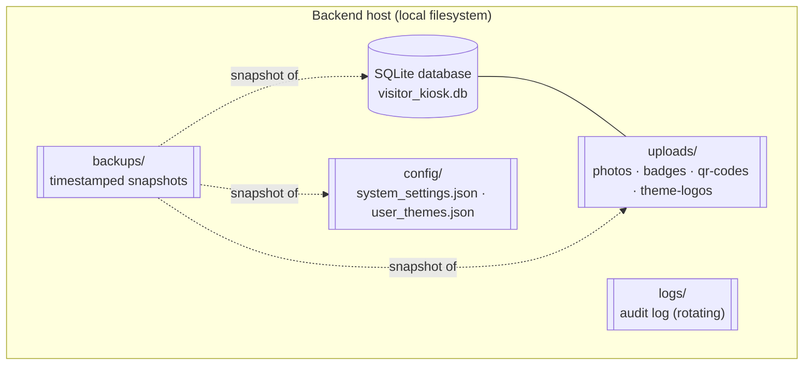

# Data Flow — PBC Guest Kiosk

**Audience:** Developers, volunteer IT, and administrators who need to know what data the
system holds, where it lives, how it changes, and how long it stays.

**Status:** Grounded in the source at `v1.0.0-rc.1`. Terms are defined in the
[System Glossary](../00-Executive/SystemGlossary.md). Storage locations here are the code's
actual paths.

---

## 1. Where data lives

All authoritative state is **local to the backend host**. There are three stores:

| Data | Created by | Stored in | Retention |
| --- | --- | --- | --- |
| Visitor data | Check-in / returning check-in | `visitors` table | Kept indefinitely (see [§2](#2-visitor-data)) |
| Photos | Photo upload | `uploads/photos/{id}.jpg` | Kept indefinitely |
| Badges | Badge generation | `uploads/badges/{id}.png` | Kept indefinitely; regenerable |
| Print jobs | Kiosk print / reprint | `print_jobs` table | Until cleared or cascade-deleted |
| Audit events | `audit(...)` calls | Rotating audit log file | Bounded by rotation (see [§6](#6-audit-events)) |
| Backups | Backup tool | `backups/<timestamp>/` | Newest 14 snapshots by default |

## 2. Visitor data

**Creation.** A `visitors` row is created at check-in (`POST /api/visitors`) or when a
returning visit is started (`POST /api/visitors/{id}/checkin-again`). Each visit is always its
own row. The row captures identity, contact details, host, purpose, the captured photo/badge
paths, timestamps, and the `print_station_id` chosen at check-in.

**Updates.** Over a visit's life the row is updated to record the photo path, the badge path,
the `badge_printed` flag (set when a print job completes), and finally `check_out_time` and
`check_out_method` at check-out. Staff can also edit a visitor's details.

**Storage.** The `visitors` table in the single SQLite database. This is **PII** — names,
contact information, and a reference to a facial photo.

**Retention.** Visitor rows are **kept indefinitely**. At `v1.0.0-rc.1` there is **no
automatic expiry and no in-application endpoint to delete a visitor**. Check-out ends a visit
but does not remove the record. This is current behavior, stated as a known data-retention
characteristic — not a recommendation. (Rows are removed only if the underlying row is deleted
through database maintenance, which cascades to that visitor's print jobs.)

## 3. Photos

**Creation.** A photo is uploaded per visit (`POST /api/visitors/{id}/photo`), validated, and
re-encoded to a bounded JPEG (see [Visitor Lifecycle §3](VisitorLifecycle.md#3-photo-capture)
and [Security Controls §5](../06-Reference/SecurityControls.md#5-upload-boundaries-f-010)).

**Updates.** Re-uploading overwrites the file at the same per-visitor path and clears the
stored badge path (a new photo invalidates the old badge). A returning visit may **reuse** the
original visit's photo rather than capturing a new one.

**Storage.** `uploads/photos/{visitor_id}.jpg`, served read-only under `/uploads`. This is
**PII** (a facial image).

**Retention.** Photo files are **kept indefinitely** alongside their visitor row; there is no
automatic cleanup at `v1.0.0-rc.1`.

## 4. Badges

**Creation.** A badge PNG is rendered from the visitor's photo and details
(`POST /api/visitors/{id}/badge`) and its path is recorded on the visitor.

**Updates.** The badge is regenerated on demand; uploading a new photo clears the badge path so
a stale badge is never printed.

**Storage.** `uploads/badges/{visitor_id}.png`, served read-only under `/uploads`.

**Retention.** Badge files are **kept indefinitely**, but they are **regenerable** from the
photo and visitor data, so they are the least precious of the visitor artifacts.

## 5. Print jobs

**Creation.** A `print_jobs` row is created when a badge is queued for printing — from a kiosk
(`POST /api/visitors/{id}/print`) or a staff reprint (`POST /api/visitors/{id}/reprint`). It is
bound at creation to a station and starts `Pending`.

**Updates.** Its lifecycle fields change as it is claimed and reported: status, the owning
agent, the lease expiry, the claim generation, the attempt count, timestamps, and any error
message. Staff can **redirect** a still-pending job to another station. The full mechanism is
in [Print Architecture](PrintArchitecture.md).

**Storage.** The `print_jobs` table. Each job references its visitor with a cascade
relationship — deleting a visitor row deletes that visitor's jobs.

**Retention.** Jobs persist until removed. Staff can clear all `Completed` or all `Failed`
jobs, or delete an individual job; jobs are also removed by cascade if their visitor is
deleted. There is no automatic time-based purge.

## 6. Audit events

**Creation.** Significant actions call the audit helper, which writes a line recording the
actor, the action, and details — for check-in/out, badge generation and printing, reprint,
redirect, print-job recovery, agent registration, and administrator actions. Kiosk actions are
logged against a non-user actor (e.g. `kiosk`); staff actions against the signed-in username.

**Updates.** The audit log is **append-only** — entries are never modified in place.

**Storage.** A rotating log file under `logs/`. The audit handler rotates at ~5 MB and keeps
10 rotated files, so total audit history on disk is **bounded** (older entries roll off as new
ones arrive). Audit events are **not** stored in the database.

**Retention.** Bounded by rotation as above. Some events (for example print-job recovery and
redirect) are recorded here as part of their trail; see
[Security Controls §6](../06-Reference/SecurityControls.md#6-audit-logging).

> **Implication.** Because audit history is capped by log rotation, it is a short-to-medium
> operational trail, not a permanent archive. Preserving it long-term is an operational choice
> (e.g. including `logs/` in an external copy), outside the application.

## 7. Backups

**Creation.** The backup tool assembles a snapshot: a transactionally consistent copy of the
SQLite database (via SQLite's online backup API, verified with an integrity check), plus the
`uploads/` categories and the runtime `config/` files, plus a manifest. See
[System Components §7](SystemComponents.md#7-backup-subsystem).

**Updates.** Snapshots are immutable once written; a new backup is a new timestamped directory.

**Storage.** By default under `backups/` on the backend host, one directory per snapshot
(`<UTC-timestamp>[__label]/`). A snapshot **contains PII** because it includes the database and
the photos.

**Retention.** By default the tool keeps the **newest 14** snapshots and prunes older ones when
it runs with the default retention. Where snapshots ultimately reside and how they are
protected is an operational matter covered by
[Security Controls §8](../06-Reference/SecurityControls.md#8-backup-protections) and the
[Disaster Recovery guide](../DISASTER-RECOVERY.md).

## 8. Configuration data (supporting)

Two runtime configuration files round out the picture: `config/system_settings.json` (operator
settings, including the check-in base URL and lockout policy source of truth) and
`config/user_themes.json` (custom badge themes). They are created/updated through staff and
administrator settings endpoints, stored under `config/`, kept until changed, and included in
every backup. Tunable inputs (environment variables) are catalogued in
[Environment Variables](../06-Reference/EnvironmentVariables.md).
