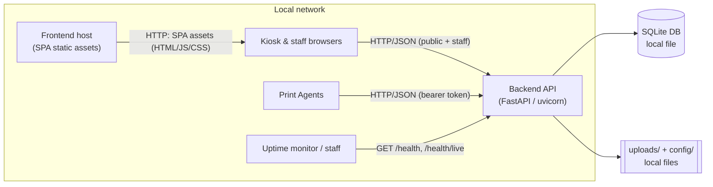
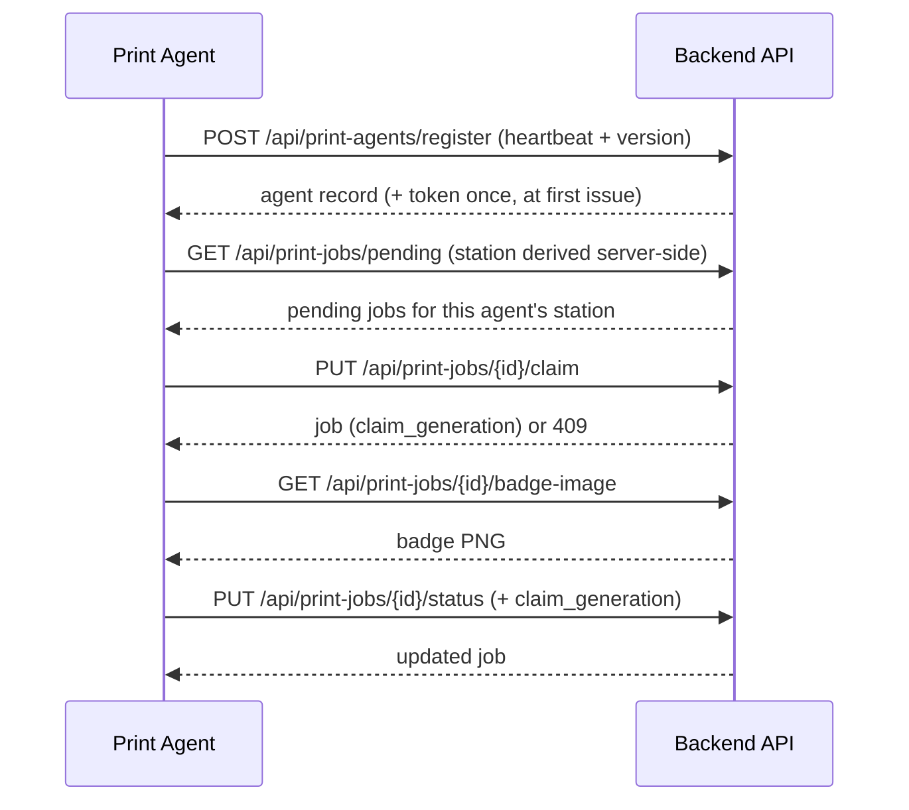
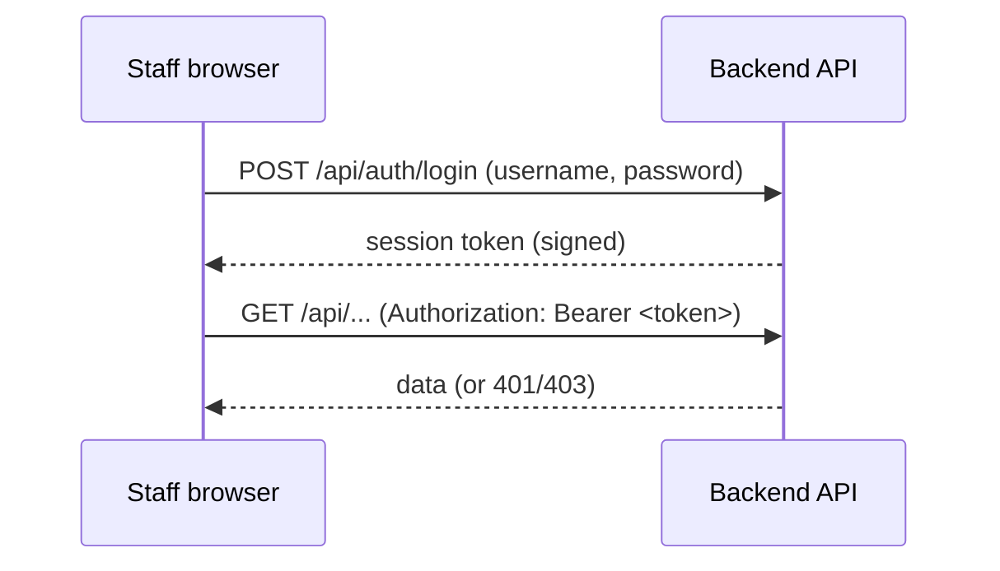

# Network Flow — PBC Guest Kiosk

**Audience:** Volunteer IT and developers who need to understand what talks to what, in
which direction, and with what authentication.

**Status:** Grounded in the source at `v1.0.0-rc.2`. This document describes the network
*shape* of the running system. It is not a deployment or firewall guide; supported hardware
and deployment shapes live in the [Hardware Matrix](../06-Reference/HardwareMatrix.md) and
[What Is the PBC Guest Kiosk? §7](../00-Executive/WhatIsGuestKiosk.md#7-supported-deployment-models).

---

## 1. The one rule: everything connects *to* the backend

For the application's own traffic — **API calls, health checks, and print-agent polling** —
every conversation is **initiated toward the Backend API** over HTTP/JSON. Browsers (once
loaded), print agents, and monitors all reach in to the backend; the backend never dials
out to them. This pull-based shape is what makes the system easy to place on a simple local
network.

The one separate flow is the **initial page load**: a browser first downloads the React
single-page app (HTML, JS, CSS) from wherever the frontend is served — the Vite dev server
in development, or a static file host in a deployed setup — and only then does the loaded
app make its API calls to the backend. Static frontend assets are delivered from the
frontend host; all data, health, and print traffic flows inward to the backend.

The database and files are **local to the backend host** — reached through the filesystem,
not over the network.

## 2. Browser to backend

The frontend is a single-page app that calls the backend at the base URL configured by
`VITE_API_BASE`. Its calls fall into three trust tiers:

- **Public (no sign-in):** kiosk check-in, photo upload, badge generation, requesting a
  print, and a visitor checking their own print status. These are the endpoints a guest at a
  kiosk uses.
- **Authenticated staff:** listing and managing visitors, the print queue, reprint/redirect,
  and station/agent views. These require a session token (see [§5](#5-authentication)).
- **Administrator:** system settings, agent approval/assignment, and permanent deletes —
  gated on the `Administrator` role.

Uploaded photos and generated badges are served back as static files under `/uploads`.

In the optional container deployment, the browser uses one public origin:
frontend nginx serves the SPA and proxies `/api/*`, `/uploads/*`, and `/health*`
to the internal backend. With Caddy, traffic flows Caddy → frontend nginx →
backend. Backend port `8000` is not published to the host.

## 3. Print agent to backend

Each print agent reaches the backend at the address in its `PBC_API_BASE` setting. **All**
traffic is agent-initiated; the backend never connects to an agent. Over one poll cycle
(every couple of seconds) an agent makes these calls, each carrying its bearer token:

For containers, `PBC_API_BASE` is the public frontend/Caddy origin rather than
the internal `backend:8000` address; nginx preserves and forwards the `/api/*`
paths used below. Configure the origin only; do not append `/api`.

Because the station is resolved from the authenticated agent, an agent cannot fetch or act on
another station's jobs — the backend enforces this on claim and status calls. The full
mechanics are in [Print Architecture](PrintArchitecture.md).

## 4. Health monitoring

Health is **pull-based**. Anything that wants to know the system's state issues a plain
`GET`:

- `GET /health/live` — a cheap liveness check ("the process is up") that touches no
  dependencies.
- `GET /health` — a readiness check that verifies the database, upload directories,
  configuration file, and backup subsystem, and returns **HTTP 503** when any critical
  dependency is unavailable.

No credentials are required to read health, and no state is changed. Details are in
[System Components §8](SystemComponents.md#8-monitoring--health) and
[Security Controls §11](../06-Reference/SecurityControls.md#11-health-monitoring-protections).

## 5. Authentication

There are two distinct authentication paths on the wire:

**Staff sign-in.** A staff user posts credentials to `POST /api/auth/login`; on success the
backend returns a signed session token, which the frontend then sends on the
`Authorization` header of subsequent staff requests. Repeated failed sign-ins can lock an
account. Authorization beyond "signed in" is limited to the `Administrator` role.

**Print-agent authentication.** Each agent presents a per-agent **bearer token** issued once
at enrollment. New agents enroll disabled and must be approved by an Administrator before they
are trusted. The token is stored only as a one-way hash on the backend.

The authoritative, control-by-control description of both paths — token handling, lockout,
CORS, and secrets — is in [Security Controls](../06-Reference/SecurityControls.md); this
document does not restate those specifics.

## 6. Backup and restore activity

Backup and restore are **local, filesystem operations**, not network endpoints. The backup
tool runs on the backend host, reads the live database (through SQLite's online backup API)
and the `uploads/` and `config/` files directly from disk, and writes a snapshot directory to
local storage. Restore is likewise a local operation. **No backup or restore traffic crosses
the network as part of the application**, and there is no in-app HTTP endpoint that triggers a
backup or restore. Where this data lives and how long it is kept is covered in
[Data Flow §7](DataFlow.md#7-backups); the procedure is the
[Disaster Recovery guide](../DISASTER-RECOVERY.md).

> Any off-host copying of snapshots (to another disk or machine) is an operational choice made
> outside the application and is out of scope for this architecture document.

## 7. Network assumptions

The architecture assumes:

- **A single, trusted local network** connecting kiosks, the backend host, and print
  stations. The tested model places the backend and print agents on the same LAN, with agents
  configured to a fixed backend host and port.
- **Application traffic flows inward to the backend.** For API, health, and print-agent
  traffic, browsers, agents, and monitors initiate; the backend serves and does not open
  connections back to clients or agents. Delivering the frontend's own static assets to the
  browser is a separate concern, handled by whatever serves the SPA (see
  [§1](#1-the-one-rule-everything-connects-to-the-backend)).
- **Cross-origin access is bounded by CORS.** Which origins may call the API is controlled by
  configuration, described in
  [Security Controls §4](../06-Reference/SecurityControls.md#4-cross-origin-resource-sharing-cors-f-008).
- **The application serves HTTP/JSON and does not itself terminate TLS.** Transport
  encryption, if required, is an operational concern outside the application and is not
  described here.
- **The database and uploaded/rendered files are local to the backend host**, reached over the
  filesystem rather than the network.
