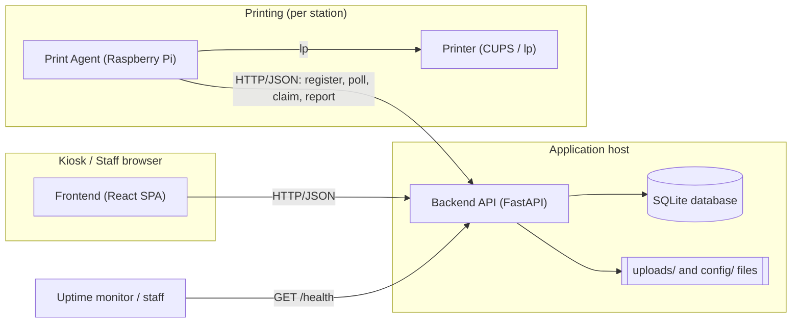

# Architecture Overview — PBC Guest Kiosk

**Audience:** New developers, volunteer IT, and camp administrators who need to
understand how the PBC Guest Kiosk is put together without reading the source code.

**Status:** Describes the system as it exists at `v1.0.0-rc.1`. Every statement is
grounded in the current repository. This document is a map; each section links to the
deeper document that owns the detail.

**Scope:** Architecture only. This document does **not** cover installation, deployment
mechanics, or troubleshooting — those live in the operational guides linked from the
[Documentation Map](#10-documentation-map).

---

## 1. System Purpose

The PBC Guest Kiosk is a self-hosted visitor check-in and badge-printing system for a
camp. Guests check themselves in at a kiosk, have a photo taken, and receive a printed
badge. Staff can see who is on site, check people out, and manage printing. The
authoritative plain-language description of what the system is and the problems it solves
is [What Is the PBC Guest Kiosk?](../00-Executive/WhatIsGuestKiosk.md).

For the meaning of any term used below, see the
[System Glossary](../00-Executive/SystemGlossary.md).

## 2. Key Design Goals

These goals are visible in the code and shape the architecture:

- **Fail closed, never guess.** Check-in and printing refuse to proceed when their
  required inputs (a valid, enabled print station) are missing, rather than defaulting to
  a fallback.
- **Single source of truth per fact.** A visitor's print station is stored once, on the
  visitor. Agent/station liveness is derived from one place. Duplicated liveness paths
  were deliberately removed.
- **Correctness at the claim, not the sweep.** Exactly-once printing is enforced by a
  single atomic database claim; recovery of abandoned work is a conservative backstop, not
  the primary mechanism (see [Print Architecture](PrintArchitecture.md)).
- **Small, self-hostable footprint.** A Python/FastAPI backend, a single-page React
  frontend, a SQLite database, and a lightweight print agent — no external cloud services
  are required to run.
- **Defensive boundaries.** Uploads are size- and content-checked, agents authenticate
  with their own tokens, and administrator actions are gated. See
  [Security Controls](../06-Reference/SecurityControls.md).

## 3. High-Level Architecture

The **frontend** is a browser single-page app that talks to the **backend** exclusively
over HTTP/JSON. The **backend** owns all state: it reads and writes the **SQLite
database** and the **uploads/config files**. Each **print station** has a **print agent**
that reaches the backend over HTTP to fetch and claim jobs, then drives a local
**printer** through CUPS. Health checks are pull-based over HTTP.

## 4. Primary Components

| Component | What it is | Detail |
| --- | --- | --- |
| Frontend | React single-page app served to kiosk and staff browsers. | [System Components §1](SystemComponents.md#1-frontend) |
| Backend API | FastAPI application; the only writer of state. | [System Components §2](SystemComponents.md#2-backend-api) |
| Database | Single SQLite file holding visitors, jobs, users, stations, agents. | [System Components §3](SystemComponents.md#3-database) |
| Print Queue | The `print_jobs` table plus its claim/lease/recovery logic. | [System Components §4](SystemComponents.md#4-print-queue) |
| Print Agents | Per-station processes that print badges via CUPS. | [System Components §5](SystemComponents.md#5-print-agents) |
| Badge Rendering | Turns a visitor + photo into a printable PNG. | [System Components §6](SystemComponents.md#6-badge-rendering) |
| Backup Subsystem | Standalone tool that snapshots the DB and files. | [System Components §7](SystemComponents.md#7-backup-subsystem) |
| Monitoring / Health | `/health` and `/health/live` readiness/liveness endpoints. | [System Components §8](SystemComponents.md#8-monitoring--health) |
| Audit Logging | Append-only record of significant actions. | [System Components §9](SystemComponents.md#9-audit-logging) |

## 5. External Dependencies

The running system depends on a small, self-contained set of parts:

- **Python runtime + backend libraries** (FastAPI, SQLAlchemy, Pydantic, Pillow, etc.) for
  the backend and print agent.
- **A web browser** for the kiosk and staff interfaces.
- **CUPS** on each print host, providing the `lp`/`lpstat` commands the agent shells out
  to. This makes the print agent Linux/Raspberry-Pi–oriented; see the
  [Hardware Matrix](../06-Reference/HardwareMatrix.md).
- **The local network** connecting kiosks, the server, and print agents.

There is **no dependency on any external/cloud service** to operate. The full inventory of
required and optional software is in the
[Software Matrix](../06-Reference/SoftwareMatrix.md), and all tunables are listed in
[Environment Variables](../06-Reference/EnvironmentVariables.md).

## 6. Security Boundaries

At a high level:

- **Public, unauthenticated surface:** kiosk check-in, photo upload, badge generation, and
  a visitor's own print-status lookup. These are bounded by fail-closed station rules and
  strict upload validation.
- **Authenticated staff surface:** visitor management, the print queue, reprint/redirect,
  and station/agent views — all require a signed-in user.
- **Administrator-only surface:** system settings, agent approval/assignment, and permanent
  deletes require the `Administrator` role — the only role enforced in code.
- **Print-agent surface:** agents authenticate with per-agent bearer tokens and may only
  act on jobs for their own station.

The authoritative, control-by-control description lives in
[Security Controls](../06-Reference/SecurityControls.md); this document does not restate
it. Boundaries as they appear on the wire are drawn in [Network Flow](NetworkFlow.md).

## 7. Physical Deployment Model

The tested model is a single application host on a local network, with one or more kiosks
(browsers) and one or more print stations, each print station being a Raspberry Pi running
a print agent next to a label printer. This is the shape the architecture assumes; the
specific supported hardware classes (tested-good, expected-good, untested, not-supported)
are enumerated in the [Hardware Matrix](../06-Reference/HardwareMatrix.md), and the
supported deployment shapes are summarized in
[What Is the PBC Guest Kiosk? §7](../00-Executive/WhatIsGuestKiosk.md#7-supported-deployment-models).

> This document does not describe container/Docker deployment. No container assets exist in
> the repository, and none are implied by the architecture.

## 8. Printing Architecture Summary

Printing is deliberately split into three concepts — **Printer** (hardware), **Print
Agent** (software), and **Print Station** (logical destination). A badge is generated,
queued as a **Print Job** bound to the visitor's station, then claimed and printed by an
agent serving that station. Exactly-once behavior comes from a single atomic claim that
leases the job; abandoned leases are recovered conservatively. The complete explanation —
including claim leases, heartbeats, retries, recovery, reprint, redirect, and offline-
printer behavior — is in [Print Architecture](PrintArchitecture.md).

## 9. Backup & Recovery Summary

The system can be snapshotted into a self-contained backup directory containing a
transactionally consistent copy of the SQLite database, the `uploads/` files, and the
runtime `config/` files, with a manifest. Backups are produced by a standalone, stdlib-only
tool decoupled from the web application; restore reverses the process and clears stale
SQLite sidecar files. Where backup data travels and is stored is covered in
[Data Flow](DataFlow.md); the protections around it are in
[Security Controls §8](../06-Reference/SecurityControls.md#8-backup-protections); the
operational procedure is the [Disaster Recovery guide](../DISASTER-RECOVERY.md).

## 10. Documentation Map

**Architecture (this set — `docs/01-Architecture/`):**

- [Architecture Overview](Overview.md) — this document.
- [System Components](SystemComponents.md) — each subsystem in detail.
- [Visitor Lifecycle](VisitorLifecycle.md) — check-in to check-out, end to end.
- [Print Architecture](PrintArchitecture.md) — queue, agents, stations, recovery.
- [Network Flow](NetworkFlow.md) — who talks to whom, over what.
- [Data Flow](DataFlow.md) — how each kind of data is created, stored, and retained.

**Executive (`docs/00-Executive/`):**

- [What Is the PBC Guest Kiosk?](../00-Executive/WhatIsGuestKiosk.md)
- [System Glossary](../00-Executive/SystemGlossary.md)

**Reference (`docs/06-Reference/`):**

- [Environment Variables](../06-Reference/EnvironmentVariables.md)
- [Hardware Matrix](../06-Reference/HardwareMatrix.md)
- [Software Matrix](../06-Reference/SoftwareMatrix.md)
- [Security Controls](../06-Reference/SecurityControls.md)

**Operational guides (`docs/`):** [Installation](../INSTALL.md) ·
[Administration](../ADMINISTRATION.md) · [Print Server](../PRINT-SERVER.md) ·
[Disaster Recovery](../DISASTER-RECOVERY.md) · [Troubleshooting](../TROUBLESHOOTING.md) ·
[Known-Good Build](../KNOWN_GOOD_BUILD.md) · [Cheat Sheet](../CHEATSHEET.md)
