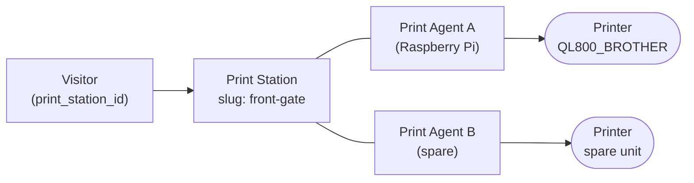
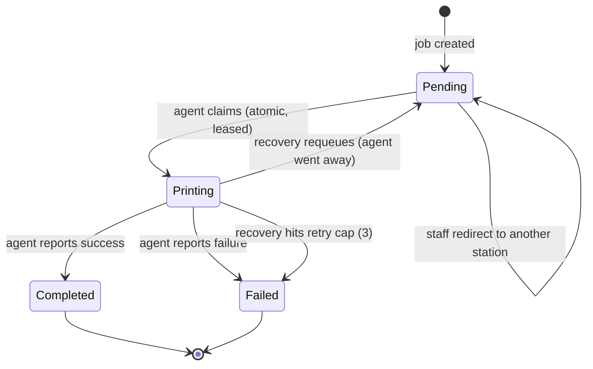

# Print Architecture — PBC Guest Kiosk

**Audience:** Developers and volunteer IT responsible for keeping badges printing.

**Status:** Grounded in the source at `v1.0.0-rc.2`. Terms are defined in the
[System Glossary](../00-Executive/SystemGlossary.md). For the operational runbook of setting
up a print host, see the [Print Server guide](../PRINT-SERVER.md) — this document explains
the *design*, not the setup.

---

## 1. Why three concepts: Printer vs Print Agent vs Print Station

This is the single most important idea in the printing design, and the one that has
historically confused operators. The system deliberately separates **three** things that
are easy to blur together:

| Concept | Layer | What it is | Identified by |
| --- | --- | --- | --- |
| **Printer** | Hardware | The physical label printer that produces a badge. | Its CUPS queue name (e.g. `QL800_BROTHER`). |
| **Print Agent** | Software | A process that drives **one** printer and talks to the backend. | A unique agent key + bearer token. |
| **Print Station** | Logical | A named *destination* — the place a visitor checked in and where their badge should come out. | A URL-safe `slug` (e.g. `front-gate`). |

**Why the separation matters:**

- **A visitor checks in at a *station*, not a printer.** The kiosk URL names a station, and
  that station is stored on the visitor. The visitor's badge must come out at *that place* —
  regardless of which specific printer or agent happens to serve it.
- **Hardware can be swapped without touching visitor data.** If a printer breaks and is
  replaced, or an agent is reinstalled on a new Raspberry Pi, the **station stays the same**.
  Visitors and their queued jobs keep pointing at the station; only the agent behind it
  changes.
- **A station can be served by more than one agent**, and an agent's online/offline state is
  what determines whether the station is "up". Separating them lets the system reason about
  "is the Front Gate printing?" independently of any one machine.
- **It removes ambiguity during incidents.** "The printer is offline" and "the agent is
  offline" and "the station has no agent" are genuinely different situations with different
  fixes. Naming them separately is what makes the queue diagnostics meaningful.



> One **station** is served by one or more **agents**; each **agent** drives one **printer**.
> The visitor only ever knows about the **station**.

## 2. Badge generation (the input to the queue)

Before anything can print, a badge image must exist. Badge generation happens per visit
(`POST /api/visitors/{id}/badge`) and writes a PNG to `uploads/badges/{visitor_id}.png`.
The queue never renders badges; it only moves already-rendered PNGs to a printer. How the
image is composed is covered in [System Components §6](SystemComponents.md#6-badge-rendering),
and where badge generation sits in the guest flow is in
[Visitor Lifecycle §4](VisitorLifecycle.md#4-badge-generation).

## 3. The Print Queue and its statuses

A **Print Job** is a row in the `print_jobs` table, bound at creation to a specific station.
Jobs are created by two paths:

- **Kiosk printing** (`POST /api/visitors/{id}/print`): the station is derived **only** from
  the visitor's stored station and the call **fails closed** if that station is missing or
  disabled.
- **Staff reprint** (`POST /api/visitors/{id}/reprint`): see [§8](#8-reprint-workflow).

Every job moves through exactly **four** statuses. There is no "Claimed" or "Redirected"
status — a claim moves a job straight to `Printing`, and a redirect leaves it `Pending`.



> A claim leads straight to `Printing`. A dedicated `Claimed → Printing` split is reserved
> for a future change and does **not** exist today.

## 4. Print Stations

A **Print Station** is a `print_stations` row with a human name, a unique `slug`, and an
`enabled` flag. The slug appears in the kiosk URL and is how a visitor's check-in is bound to
a destination. A disabled station is treated as being in **maintenance** and refuses new
work.

A station's live status is **derived from its agents**, not stored as a field that something
must remember to update. Given the last-seen times of the agents assigned to a station, the
status is one of:

| Status | Meaning |
| --- | --- |
| **maintenance** | The station is disabled. |
| **online** | At least one assigned agent has been seen within the online window (60 s). |
| **stale** | No agent is currently live, but at least one has reported before. |
| **offline** | The station is enabled but no agent has ever reported (including having no agents). |

## 5. Print Agents and the poll loop

A **Print Agent** is the `print_agent.py` process. It runs a simple, synchronous loop every
couple of seconds:

1. **Register** with the backend. This both keeps the agent's record current and updates its
   `last_seen` — registration *is* the liveness heartbeat (see [§6](#6-heartbeat-and-liveness)).
2. **Ask for pending jobs** for its station (`GET /api/print-jobs/pending`). The station is
   determined server-side from the authenticated agent; the agent sends no station parameter.
3. For each job: **claim → download → print → report** (see [§7](#7-claim-leases-and-duplicate-resistant-printing)).

The agent authenticates every call with its own **bearer token** and may only act on jobs
belonging to its own station. It shells out to **CUPS** (`lp` to print, `lpstat` to wait for
the job to drain), which is why the agent is Linux/Raspberry-Pi oriented and why there is no
Windows agent (see the [Hardware Matrix](../06-Reference/HardwareMatrix.md)).

**Agent enrollment.** A newly discovered agent registers **disabled** and must be approved by
an Administrator before it is trusted. Its credential token is issued **exactly once** at
first registration and is never silently rotated on later registrations. This is summarized in
[Security Controls §7](../06-Reference/SecurityControls.md#7-print-agent-authentication).

## 6. Heartbeat and liveness

Agent liveness is reported by the **register-on-every-poll** call, which updates the agent's
`last_seen`. Staff-facing "online" uses a 60-second window; a station is online when at least
one of its agents is within that window.

There is deliberately **one** source of liveness truth. A separate station-level heartbeat
endpoint exists in the backend, but the agent no longer calls it — that path was removed as
dead code so that station status is always derived from **agent** `last_seen`, never from a
second, independently-updated timestamp.

The 60-second visibility window is intentionally **separate** from the recovery staleness
guard (300 seconds, see [§10](#10-retries-and-recovery)), so operators can tune how quickly a
station *looks* offline without affecting when work is *recovered*.

## 7. Claim leases and duplicate-resistant printing

A Print Job has a **single active claimant** at any moment, and that guarantee — not the
recovery sweep — is what makes printing **duplicate-resistant**. It rests on a **single
atomic claim**. When an agent claims a job (`PUT /api/print-jobs/{id}/claim`):

- The agent must own the job's station, or the claim is refused (403).
- The claim is a **single conditional UPDATE**: a job is claimable only when it is `Pending`,
  or `Printing` with a lease that is null or already expired. This one statement is the
  exclusive, race-free gate — if two agents race, exactly one update affects a row and the
  other sees zero rows and gets **409**.
- A successful claim moves the job to `Printing`, records the claiming agent, sets a **lease**
  that expires 120 seconds in the future, **increments the claim generation**, and increments
  the attempt count.

The **claim generation** is the anti-stale mechanism. It is bumped on every claim, requeue,
and redirect. Every status report an agent sends must carry the generation it claimed with;
the backend rejects (409) any report whose generation does not match the job's current one.
That is how a late message from a lease that has since been recovered or reassigned is
prevented from corrupting a job that now belongs to someone else.

```mermaid
sequenceDiagram
    participant A as Print Agent
    participant API as Backend API
    participant DB as Database

    A->>API: PUT /api/print-jobs/42/claim
    API->>DB: conditional UPDATE (Pending/expired -> Printing, gen+1, attempt+1)
    alt row updated
        API-->>A: 200 job (claim_generation = N)
        A->>API: GET .../badge-image
        A->>A: lp print + wait (lpstat)
        A->>API: PUT .../status Completed (claim_generation = N)
        API->>DB: gen matches -> Completed; release lease; visitor.badge_printed=true
        API-->>A: 200
    else zero rows (already claimed)
        API-->>A: 409 not available to claim
    end
```

When a job reaches a terminal status (`Completed` or `Failed`), its lease is released so
recovery never touches it again. A `Completed` job also sets the visitor's `badge_printed`
flag and time.

**What this guarantees — and what it does not.** The atomic claim guarantees a job has only
**one active owner at a time** and that a stale report from a superseded lease is rejected
(a 409). It does **not** guarantee a single *physical* badge. There is a real failure
window: an agent can hand a job to CUPS (`lp`) and then crash — or lose power or its
network — **before** it reports `Completed`. Its lease eventually expires and, once the
agent is also stale, recovery requeues the job (see [§10](#10-retries-and-recovery)); a
healthy agent then claims and prints it. If the first badge had already emerged from the
printer, the guest receives **two** physical badges. The database still converges to a
single, consistent `Completed` state, but the paper is duplicated. The system does **not**
detect or reconcile this automatically — recognizing and discarding a duplicate badge is an
operator action (see
[Print Operations §7](../03-Operations/PrintOperations.md#7-failover-behavior)).

## 8. Reprint workflow

A **reprint** is a staff action (`POST /api/visitors/{id}/reprint`) that always creates a
**new** `Pending` job for a visitor whose badge already exists. Because staff are
authenticated, a reprint may target a **different, enabled station** than the visitor
originally checked in at — useful when the guest is physically somewhere else. If no station
is specified, it falls back to the visitor's check-in station under the same fail-closed
rules as kiosk printing. A reprint **never** reassigns an existing job; it makes a fresh one.

## 9. Redirect workflow

A **redirect** is a staff action (`PUT /api/print-jobs/{id}/station`) that moves an existing
**still-pending** job to a different, enabled station — for example, when a job was queued for
a station that is offline. Redirect:

- Applies **only** to `Pending` jobs (in-flight or terminal jobs are never reassigned).
- Persists the new `print_station_id` on the job, clears any lease bookkeeping, and bumps the
  claim generation so a stale update cannot apply.
- Leaves the job `Pending` — there is no distinct "Redirected" status; the job simply now
  belongs to a different station.

The redirect is recorded in the audit log. Contrast with reprint: **redirect re-homes the
same job; reprint makes a new one.**

## 10. Retries and recovery

Recovery releases work abandoned by an agent that has gone away. It is **request-driven** (run
as a backstop when a claim is attempted), not a background timer, and it is deliberately
conservative. A job is recovered **only when both** conditions hold:

1. Its **lease has expired** (more than 120 seconds since the claim), **and**
2. Its **owning agent is stale** — gone, never-seen, or last seen more than **300 seconds**
   ago.

The second guard is what stops the system from stealing a job from an agent that is merely
mid-print: if the lease has lapsed but the agent is still heartbeating, the job is left alone
to finish. When both guards trip:

- The claim generation is bumped and ownership/lease fields are cleared.
- If the job has already been attempted the maximum number of times (3), it is set to
  **Failed** with a recovery reason and error message.
- Otherwise it is requeued to **Pending** with a recorded recovery reason, ready for a fresh
  atomic claim.

The two-guard model (120 s lease **and** 300 s agent staleness) keeps recovery correct without
racing legitimate slow prints. Correctness lives in the atomic claim; recovery only releases
leases so a clean claim can happen.

## 11. Offline printer and failure scenarios

The design behaves predictably when things go wrong:

| Scenario | What happens |
| --- | --- |
| **Station has no live agent** | The station shows **offline/stale**; its jobs stay `Pending` because nothing claims them. Staff can **redirect** a pending job to an online station. |
| **Agent dies mid-print** | The lease expires after 120 s. Once the agent is also stale (>300 s), recovery **requeues** the job (or **fails** it at the retry cap). The bumped generation makes any late "Completed" from the dead lease a rejected stale update. If the badge had already printed before the crash, the requeued job can produce a **second physical badge** — an operator discards the duplicate ([Print Operations §7](../03-Operations/PrintOperations.md#7-failover-behavior)). |
| **Printer error (`lp` fails)** | The agent reports **Failed** with its claim generation; the job becomes `Failed` and the lease is released. |
| **Two agents claim at once** | The atomic claim lets exactly one win; the other receives **409** and moves on. |
| **Stale message after recovery** | Rejected with **409** because its claim generation no longer matches. |

Staff visibility into these situations comes from read-only queue diagnostics, which flag a
job as needing attention when, for example, it has been `Pending` too long, is assigned to an
offline station, has stalled while `Printing`, or has been retried repeatedly. Those
attention thresholds are intentionally **separate** from the recovery/lease tuning above, so
operator-facing warnings can be adjusted without changing recovery behavior.
