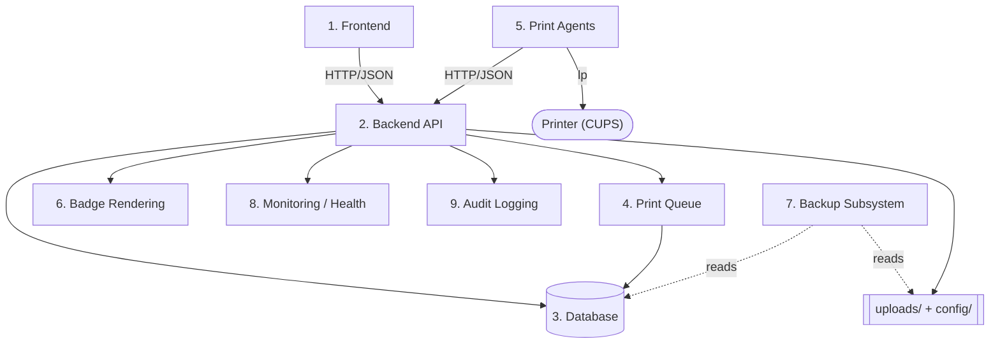

# System Components — PBC Guest Kiosk

**Audience:** Developers and volunteer IT who need to know what each subsystem does and
how the pieces depend on one another.

**Status:** Grounded in the source at `v1.0.0-rc.1`. For the wider picture see the
[Architecture Overview](Overview.md); for vocabulary see the
[System Glossary](../00-Executive/SystemGlossary.md).

Each component below is described with the same five facets: **Purpose**,
**Responsibilities**, **Dependencies**, **Inputs**, and **Outputs**.

---

## 1. Frontend

**Purpose.** Provide the browser interface for both the public kiosk (check-in, photo,
badge) and authenticated staff (dashboards, visitor management, the print queue, station
and agent views).

**Responsibilities.** Render the check-in flow, capture the visitor photo in the browser,
present staff screens, and call the backend for every piece of data or action. It holds no
authoritative state of its own.

**Dependencies.** The Backend API only. It is a React single-page application built with
Vite and reaches the backend at the base URL configured by `VITE_API_BASE` (see
[Environment Variables](../06-Reference/EnvironmentVariables.md)).

**Inputs.** User interaction (form entry, webcam capture, staff clicks) and JSON responses
from the backend.

**Outputs.** HTTP/JSON requests to the backend and the rendered UI. It never touches the
database or filesystem directly.

## 2. Backend API

**Purpose.** Be the single application server and the **only writer of state**. Every
create, update, and delete flows through here.

**Responsibilities.** Serve all API endpoints: visitor check-in/out, photo upload, badge
generation, the print queue and its lifecycle, authentication and account lockout, print
station and print agent management, system settings and themes, health checks, and audit
logging.

**Dependencies.** The SQLite database (via SQLAlchemy), the `uploads/` and `config/`
directories, Pillow (image handling), the [Badge Rendering](#6-badge-rendering) service,
the [Backup Subsystem](#7-backup-subsystem) (imported by the health check), and the
[liveness](#8-monitoring--health) logic.

**Inputs.** HTTP requests from browsers and from print agents.

**Outputs.** JSON responses, database writes, files written under `uploads/`, audit-log
entries, and the statically served `/uploads` path.

## 3. Database

**Purpose.** Be the authoritative store for all operational state.

**Responsibilities.** Persist six tables — `visitors`, `print_jobs`, `users`,
`print_stations`, `print_agents`, and `print_agent_credentials`. Additive schema
migrations for ownership, station-routing, and lockout columns are applied at startup.

**Dependencies.** The local filesystem. It is a single SQLite database file
(`visitor_kiosk.db`); the connection string is fixed in code and there is **no**
environment-variable override for the database location at `v1.0.0-rc.1`. See
[Data Flow](DataFlow.md) for what each table holds.

**Inputs.** SQLAlchemy sessions opened by the Backend API.

**Outputs.** Persisted rows returned to the Backend API.

## 4. Print Queue

**Purpose.** Coordinate exactly-once badge printing across one or more print agents.

**Responsibilities.** Hold Print Jobs in one of four statuses (`Pending`, `Printing`,
`Completed`, `Failed`); grant a job to exactly one agent via an atomic, leased claim;
recover jobs abandoned by a dead agent; validate every agent status report against the
job's claim generation; and let staff redirect a still-pending job to another station.

**Dependencies.** The Database (the `print_jobs` table), the Print Stations and Print
Agents it references, and the read-only liveness and queue-diagnostics logic. The full
mechanism is documented in [Print Architecture](PrintArchitecture.md).

**Inputs.** Job creation (kiosk check-in printing and staff reprints), agent claim and
status calls, and staff actions (redirect, clear completed/failed).

**Outputs.** Updated job rows, the `badge_printed` flag set on the visitor when a job
completes, and audit entries for redirects and recoveries.

## 5. Print Agents

**Purpose.** Bridge the Print Queue to a physical printer at one print station.

**Responsibilities.** Register with the backend on every poll (which also reports the
agent's liveness), ask for its station's pending jobs, claim a job, download the badge
image, send it to the printer through CUPS, and report the outcome. The agent persists its
own key, station assignment, and credential token to a local `.env` file.

**Dependencies.** The Backend API over HTTP, and **CUPS** (`lp` / `lpstat`) on the local
host. Because it shells out to CUPS, the agent is Linux/Raspberry-Pi oriented; a Windows
print agent does not exist and is listed **not supported** in the
[Hardware Matrix](../06-Reference/HardwareMatrix.md).

**Inputs.** Pending-job JSON from the backend and downloaded badge PNGs.

**Outputs.** Claim and status HTTP calls, physical badge prints, and an updated
`last_seen` timestamp that drives station liveness.

## 6. Badge Rendering

**Purpose.** Turn a visitor and their photo into a printable badge image.

**Responsibilities.** Compose the visitor's photo and details into a fixed-geometry badge
and write it to disk as a PNG.

**Dependencies.** Pillow, the badge theme and badge layout definitions, and system fonts
(it tries Windows Arial, then common Linux fonts, then a built-in fallback). Internally the
renderer reads `PBC_BADGE_THEME` (default `PBC_standard`) to pick a colour set, but this is
**not an operator control at `v1.0.0-rc.1`**: the only named theme is `PBC_standard` (no
alternative has been built or tested) and the **layout (geometry) is fixed** in code. Badge
appearance is effectively fixed for this release.

**Inputs.** A visitor record plus the visitor's uploaded photo file (a photo must exist
first).

**Outputs.** A badge PNG written to `uploads/badges/{visitor_id}.png`, whose path is
recorded on the visitor.

## 7. Backup Subsystem

**Purpose.** Produce and restore self-contained, point-in-time snapshots of the system.

**Responsibilities.** Copy the SQLite database using SQLite's **online backup API** (never
a raw file copy) and verify the copy with an integrity check; copy the `uploads/`
categories and the runtime `config/` files; and write a manifest. On restore, it clears
stale SQLite sidecar files so an old journal cannot shadow the restored database.

**Dependencies.** The Python standard library only (it is intentionally decoupled from the
web application) and the filesystem. It can run as a standalone command-line tool and is
also importable — the health check imports its default backup root to confirm the
destination is writable.

**Inputs.** The live database, `uploads/`, and `config/`.

**Outputs.** A timestamped snapshot directory containing the database copy, uploads,
config, and a manifest. Protections are described in
[Security Controls §8](../06-Reference/SecurityControls.md#8-backup-protections); the
operational procedure is the [Disaster Recovery guide](../DISASTER-RECOVERY.md).

## 8. Monitoring / Health

**Purpose.** Let an uptime monitor or a staff member tell whether the backend is up and
able to serve.

**Responsibilities.** Expose two endpoints: `/health/live` (a cheap liveness probe that
touches nothing) and `/health` (a readiness probe that checks the database, the upload
directories, the configuration file, and the backup subsystem, returning HTTP **503** when
any critical check fails). Print-infrastructure counts (online agents, enabled stations)
are reported for information and never make the endpoint report unhealthy.

**Dependencies.** The Database, the filesystem (upload/config directories), the Backup
Subsystem (import check), and the liveness logic used to count online agents.

**Inputs.** HTTP `GET` requests.

**Outputs.** A JSON status document including the release version and per-check results.
See [Security Controls §11](../06-Reference/SecurityControls.md#11-health-monitoring-protections).

## 9. Audit Logging

**Purpose.** Keep an append-only record of significant actions for accountability.

**Responsibilities.** Record who did what and with what details for check-in and check-out,
badge generation and printing, reprint and redirect, print-job recovery, print-agent
registration, and administrator actions.

**Dependencies.** Python logging, writing to a rotating audit log file under `logs/`.

**Inputs.** `audit(...)` calls made by the Backend API endpoints. Kiosk actions are logged
against a non-user actor (for example, `kiosk`); staff actions are logged against the
signed-in username.

**Outputs.** Lines appended to the audit log. Some events are recorded here as their
primary record — see [Data Flow](DataFlow.md) and
[Security Controls §6](../06-Reference/SecurityControls.md#6-audit-logging).
