# Visitor Lifecycle — PBC Guest Kiosk

**Audience:** Anyone who needs to follow a guest from arrival to departure and understand
what the system records at each step.

**Status:** Grounded in the source at `v1.0.0-rc.1`. Terms used here are defined in the
[System Glossary](../00-Executive/SystemGlossary.md). The printing steps are summarized
here and fully explained in [Print Architecture](PrintArchitecture.md).

---

## 1. The lifecycle at a glance

```mermaid
flowchart TD
    Start([Guest arrives at a kiosk]) --> Known{Been here before?}

    Known -- No --> NewCheckIn["New check-in<br/>POST /api/visitors<br/>(station comes from the kiosk URL)"]
    Known -- Yes --> Returning["Returning check-in<br/>POST /api/visitors/&#123;id&#125;/checkin-again<br/>(staff-assisted; new visit row)"]

    NewCheckIn --> Photo["Photo capture<br/>POST /api/visitors/&#123;id&#125;/photo"]
    Returning --> Photo

    Photo --> Badge["Badge generation<br/>POST /api/visitors/&#123;id&#125;/badge"]
    Badge --> Queue["Print job created (Pending)<br/>POST /api/visitors/&#123;id&#125;/print"]
    Queue --> Print["Badge printed by the station's agent<br/>(see Print Architecture)"]
    Print --> OnSite([Guest is on site])
    OnSite --> CheckOut["Check-out<br/>PUT /api/visitors/&#123;id&#125;/checkout<br/>or bulk check-out"]
    CheckOut --> Done([Visit ends])
    Done -. next time .-> Returning
```



Each box is a real endpoint. The station a badge prints at is decided **once**, at
check-in, and carried forward from there.

## 2. New visitor and check-in

A guest at a kiosk fills in their details and checks in. Check-in is **public and
unauthenticated** (`POST /api/visitors`). The critical rule is that the **print station is
taken from the kiosk URL**, not from anything the guest types, and check-in **fails closed**:

- If no station is supplied, or the named station is unknown or disabled, check-in is
  rejected — the system never falls back to a default station.
- On success a new `visitors` row is created with `check_in_time` set and the station
  stored as `print_station_id`. That station is the single source of truth for where this
  visitor's badge will print.

The check-in is recorded in the audit log against the `kiosk` actor (no staff user is
signed in at a kiosk).

## 3. Photo capture

The visitor's photo is captured in the browser and uploaded with
`POST /api/visitors/{id}/photo`. The backend enforces strict bounds before trusting the
image:

- The upload is rejected if it exceeds the size cap (default 5 MB) or is empty.
- The image is decoded through Pillow — which rejects non-image or malformed files — with a
  global pixel cap that guards against decompression-bomb images.
- The accepted image is re-oriented from EXIF, converted to RGB, shrunk so its longest edge
  fits the maximum dimension (default 1600 px), and re-saved as a bounded JPEG. Re-encoding
  drops any embedded metadata or payload.

The saved photo path is recorded on the visitor, and any previously generated badge path is
cleared (a new photo means the old badge is stale). These upload protections are described
in [Security Controls §5](../06-Reference/SecurityControls.md#5-upload-boundaries-f-010).

## 4. Badge generation

With a photo present, the badge is generated (`POST /api/visitors/{id}/badge`). The backend
refuses to generate a badge if no photo has been uploaded. On success it renders a badge
PNG from the visitor's details and photo and records the badge path on the visitor. How the
badge image itself is composed is described in
[System Components §6](SystemComponents.md#6-badge-rendering).

## 5. Print queue creation

Once a badge exists, a **Print Job** is created (`POST /api/visitors/{id}/print`). As with
check-in, the destination station is derived **solely** from the visitor's stored
`print_station_id` and the operation **fails closed**: if the visitor has no station, or the
station is disabled, no job is created. On success a `print_jobs` row is inserted with
status `Pending`, bound to the visitor's station.

## 6. Badge printing

The station's print agent picks up the Pending job, claims it exclusively, prints it, and
reports the result. When a job reaches `Completed`, the backend marks the visitor's
`badge_printed` flag and records the time. The full claim/lease/print/recover mechanism is
documented in [Print Architecture](PrintArchitecture.md) and is not repeated here.

```mermaid
sequenceDiagram
    participant Kiosk as Kiosk (browser)
    participant API as Backend API
    participant DB as Database
    participant Agent as Print Agent
    participant Printer as Printer (CUPS)

    Kiosk->>API: POST /api/visitors (check-in, station from URL)
    API->>DB: create visitor (Pending state)
    Kiosk->>API: POST .../photo
    API->>DB: store photo path
    Kiosk->>API: POST .../badge
    API->>DB: store badge path
    Kiosk->>API: POST .../print
    API->>DB: create print job (Pending)
    Agent->>API: GET /api/print-jobs/pending
    Agent->>API: PUT .../claim
    API->>DB: job -> Printing (leased)
    Agent->>API: GET .../badge-image
    Agent->>Printer: lp (print badge)
    Agent->>API: PUT .../status (Completed + claim_generation)
    API->>DB: job -> Completed; visitor.badge_printed = true
```

## 7. Check-out

A visit ends at check-out. Two paths exist, both setting `check_out_time` and recording the
method on the visitor:

- **Manual check-out** (`PUT /api/visitors/{id}/checkout`) ends a single visit and records
  method `Manual Checkout`.
- **Bulk check-out** (`POST /api/visitors/bulk-checkout`) ends every active visit at once
  and records method `Bulk Checkout` — typically an end-of-day action.

A visit with no `check_out_time` is considered **active**, which is how staff dashboards
know who is currently on site.

## 8. Returning visitor and repeat visits

When a guest who has been before returns, staff start a **returning check-in** from the
guest's existing record (`POST /api/visitors/{id}/checkin-again`). This is a staff-assisted,
authenticated action that:

- Creates a **new** visit row (each visit is always its own row) copying the person's
  identity, optionally reusing the existing photo, and **carrying over the same print
  station** as the original visit — with no client override.
- Refuses to create the visit if that person already has an active visit, matched by
  **first name and last name**.

> **Known limitation (current behavior).** The system has **no canonical person identity**.
> A "returning visitor" is recognized purely by matching first + last name. Two different
> people with the same name are treated as the same person for the duplicate-active check
> and for visit history; the code notes person-identity tracking as a future enhancement.
> This is documented, not aspirational — it is how the system behaves today.

From here the returning visit follows the same photo → badge → print → check-out path as any
other visit.
