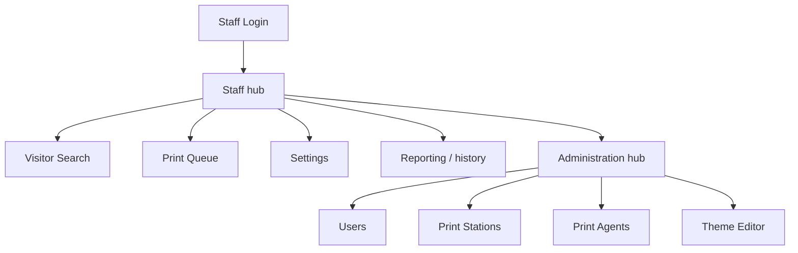

# Administration — PBC Guest Kiosk

**Audience:** Camp office staff, camp administrators, and volunteer IT.

**Purpose:** How to run and administer the kiosk day to day — managing users,
searching visitors, reprinting badges, and keeping print stations and agents
healthy. This is an operations guide; it links to the reference and architecture
docs rather than repeating them.

**Related:** [Troubleshooting](Troubleshooting.md) · [Print Operations](PrintOperations.md) ·
[Backup & Recovery](BackupAndRecovery.md) · [Quick Reference](QuickReference.md)

---

## 1. Administrative Overview

The kiosk is a single web application (the "SPA") backed by one API service. Staff
and administrators use the **same** application they sign in to; there is no separate
admin website. After signing in, an administrator reaches the admin areas by
navigating the app:

What is enforced by the software versus what is organizational convention matters
here: **only the `Administrator` role is enforced in code.** The administration
screens (Users, Print Stations, Print Agents, Theme Editor) and system settings
reject non-administrators; everything else is available to any signed-in staff
member. See [Role Management](#3-role-management) below and
[Security Controls §2](../06-Reference/SecurityControls.md#2-authorization-rbac).

## 2. User Management

Staff accounts are created and maintained on the **Administration → Users** screen
(administrators only). The system supports many accounts; there is no single-account
limitation.

Typical tasks:

- **Create an account** for an authorized staff member (name, username, password,
  role). Prefer individual accounts over shared logins.
- **Disable an account** when a volunteer or seasonal staff member leaves, or if a
  credential may be compromised. Disable rather than delete so historical records
  stay intact.
- **Reset a password** when someone is locked out or has forgotten it; the account
  can be required to change the password at next sign-in.

Two protections are built in and are documented in the reference layer rather than
here: **account lockout** after repeated failed sign-ins, and the **initial admin
account** seeded from environment variables on first run. See
[Security Controls §3](../06-Reference/SecurityControls.md#3-account-lockout-f-009)
and the `PBC_DEFAULT_ADMIN_*` and `PBC_LOGIN_LOCKOUT_*` entries in
[Environment Variables](../06-Reference/EnvironmentVariables.md). Do not restate the
password policy in local notes — point people at those documents.

## 3. Role Management

The software enforces exactly **one** role check: whether an account is an
`Administrator`. Administrators can reach Users, Print Stations, Print Agents, the
Theme Editor, and system settings. Every other signed-in account can do everything
that is *not* administrator-gated — search visitors, check visitors in and out, and
reprint badges.

Role names other than `Administrator` (for example "Office Staff" or "Volunteer")
are an **organizational convention only**. Assigning someone a non-administrator
role does **not** technically restrict them to a smaller subset of the non-admin
actions — the code does not distinguish among non-admin roles. Treat those labels
as documentation of intent, and grant `Administrator` only to people who should
manage the system. The authoritative description is
[Security Controls §2](../06-Reference/SecurityControls.md#2-authorization-rbac).

| Capability | Administrator | Any other signed-in staff |
| --- | --- | --- |
| Search / check in / check out / reprint | Yes | Yes |
| Manage users | Yes | No (enforced) |
| Print stations, print agents, themes, settings | Yes | No (enforced) |

## 4. Visitor Search

Use **Visitor Search** from the staff hub to find a visitor by name. Search is the
starting point for reviewing a visit, checking someone out, reprinting a badge, or
opening visit history. Each check-in is its own visitor record (a "visit"); the same
person checking in on different days produces multiple records. See the
[System Glossary](../00-Executive/SystemGlossary.md#visit) for the visit vs. visitor
distinction.

## 5. Visitor History Review

Opening a visitor record shows that person's **visit history**. History is grouped
by **first and last name**, so it lists prior visits for the same name along with a
visit count.

Be aware of the current limitation: because grouping is by name only, two different
people who share a name are grouped together, and a person whose name was entered
differently across visits will not be linked. This is documented behavior, not a
defect to work around in the field — see
[Visitor Lifecycle §8](../01-Architecture/VisitorLifecycle.md#8-returning-visitor-and-repeat-visits).

## 6. Check-In Operations

There are two ways a visit is created:

- **Kiosk self-service (public).** A visitor scans the **station QR code** (or opens
  that station's check-in link), enters their details, captures a photo, and a badge
  is generated and queued to **that station**. Which station a check-in belongs to is
  fixed by the QR/link — see [Print Station Management](#9-print-station-management).
- **Returning visitor (staff-assisted).** From a visitor record, staff can start a
  **returning check-in**, which creates a fresh visit that copies the person's
  identity and reuses their original station. It refuses to create a duplicate active
  visit for the same name.

The end-to-end flow (photo → badge → print → check-out) is described in
[Visitor Lifecycle](../01-Architecture/VisitorLifecycle.md); this section is only
about what an operator does.

## 7. Badge Reprints

To reprint a badge, open the visitor's record and choose **Reprint**. A reprint
creates a **new** print job in `Pending` — it never re-uses or edits the original
job. By default the reprint goes to the visitor's original check-in station; an
operator may instead direct it to a different **enabled** station. If no valid
station is available the reprint is refused rather than sent somewhere unexpected
(fail-closed). Mechanics are in
[Print Architecture §8](../01-Architecture/PrintArchitecture.md#8-reprint-workflow).

> Reprint vs. Redirect: **Reprint** makes a new job for a badge that already printed
> (or needs re-printing). **Redirect** moves a *still-pending* job to another station.
> See [Print Operations](PrintOperations.md#8-redirect-printing).

## 8. Theme Selection

PBC Guest Kiosk has **one** theme control in this release: the **website (UX) theme**
that sets the on-screen appearance of the kiosk and staff screens. The visitor
**badge** does not have a theme control in v1 -- its appearance is fixed in code (see
*Badge appearance* below).

The website theme can be changed by an administrator editing the Settings page.  A theme can then be selected from the drop list of themes.  The dropdown is populated by a combination of built-in themes and custom themes.  Custom themes can be built using the **Theme Editor** and are stored in
the runtime configuration (`backend/config/user_themes.json`) and captured by
[backups](BackupAndRecovery.md).  The **Theme Editor** allows for the creation of a new theme or the copying of themes for modification, but the built-in themes cannot be edited in the **Theme Editor.**  In addition to colors, the **Theme Editor** allows for the addition of a PNG overlay on the page and a change in the font.  Themes can be set as **CRT** to enforce a monotype font with moving scan lines for that cool retro look. 

**Badge appearance.** The visitor badge does not have a user-selectable theme in this
release. Badge colors, styling, and **layout** (dimensions and element placement) are
**fixed in code** -- they are not set from the Settings page, the Theme Editor, or the
environment. Changing badge appearance is a change-managed code edit; see
[Quick Reference](QuickReference.md#badge-appearance) and
[Change Management](#13-common-administrative-tasks).

> **Post-RTM scaffolding.** A `PBC_BADGE_THEME` environment variable exists in code
> (default `PBC_standard`) as groundwork for selectable badge themes in a future
> release. It is **not** an operational control today: there is no UI to choose or
> create badge themes, and no alternative theme has been built or tested (the only
> other named theme is identical to `PBC_standard`), so changing the value does not
> change the badge. **Leave it at the default.** See the `PBC_BADGE_THEME` entry in
> [Environment Variables](../06-Reference/EnvironmentVariables.md).

## 9. Print Station Management

A **print station** is a named check-in location that badges are routed to (for
example "Main Gate"). Manage stations on **Administration → Print Stations**.

- **Create a station** with a display name and a URL-safe **slug**.
- **Enable or disable** a station. Disabled stations do not accept new check-ins and
  are shown as in maintenance.
- **Download the station's QR code.** Each station has a QR code that encodes its
  check-in URL, formed as `<base check-in URL>/<station-slug>`. Visitors scan it to
  reach that station's kiosk. The base check-in URL is set on the **Settings** screen.
- **Rename the slug** if needed — but re-download and re-post the QR code afterward,
  because the old QR/link will no longer resolve.

The station a visit belongs to is the source of truth for where its badge prints, so
station setup is what makes multi-location printing work. Concept definitions are in
the [System Glossary](../00-Executive/SystemGlossary.md#print-station); the routing
model is [Print Operations §3](PrintOperations.md#3-print-stations).

## 10. Print Agent Monitoring

A **print agent** is the small program running on a Raspberry Pi print server that
actually sends badges to a printer. Manage and watch agents on
**Administration → Print Agents**.

- **Approve new agents.** A newly registered agent enrolls **disabled** and cannot
  print until an administrator **enables** it. This is deliberate — it prevents an
  unknown device from joining and printing. See
  [Security Controls §7](../06-Reference/SecurityControls.md#7-print-agent-authentication).
- **Watch "last seen" / online status.** An agent that has checked in within the last
  minute shows as online; one that has gone quiet shows as stale/offline. Use this to
  confirm a station's Pi is alive before guests arrive.
- **Assign an agent to a station** so its prints are attributed to the right location.

Agent behavior and how liveness is derived are covered in
[Print Operations §4](PrintOperations.md#4-print-agents) and
[System Components §5](../01-Architecture/SystemComponents.md#5-print-agents).

## 11. Daily Startup Procedure

Perform before visitors arrive:

1. **Backend reachable.** From a workstation, confirm the API answers:
   `curl http://<backend-host>:8000/` returns `{"application": "PBC Visitor Kiosk", "version": "1.0"}`.
   For a deeper check, open `http://<backend-host>:8000/health` and confirm it reports
   healthy (see [System Health Checks](Troubleshooting.md#2-system-health-checks)).
2. **Kiosk loads.** Open the kiosk on each check-in device and confirm the home screen
   and camera work.
3. **Print agents online.** On **Administration → Print Agents**, confirm each Pi shows
   as recently seen/online.
4. **Printer ready.** On the Pi, `lpstat -p` shows the queue `idle`
   (see [Print Operations](PrintOperations.md)).
5. **Test badge.** Check in a test visitor and print one badge; confirm sizing,
   brightness, alignment, and a clean cut before opening to guests.

## 12. Daily Shutdown Procedure

At the end of each day:

1. **Check everyone out** — use bulk check-out if guests remain active.
2. **Review failed print jobs** on the Print Queue and clear or reprint as needed.
3. **Take a backup** and copy it off-machine (see
   [Backup & Recovery](BackupAndRecovery.md)).
4. Shut down kiosk devices if appropriate.
5. **Leave the print server(s) running** unless maintenance is required.

## 13. Common Administrative Tasks

| Task | Where |
| --- | --- |
| Add / disable a staff account, reset a password | Administration → Users ([§2](#2-user-management)) |
| Grant or remove administrator rights | Administration → Users ([§3](#3-role-management)) |
| Find a visitor / review a visit | Visitor Search ([§4](#4-visitor-search)) |
| Reprint a badge | Visitor record → Reprint ([§7](#7-badge-reprints)) |
| Redirect a stuck pending job | Print Queue ([Print Ops §8](PrintOperations.md#8-redirect-printing)) |
| Add / disable a check-in location, get its QR | Administration → Print Stations ([§9](#9-print-station-management)) |
| Approve a new Raspberry Pi print agent | Administration → Print Agents ([§10](#10-print-agent-monitoring)) |
| Set the base check-in URL | Settings |
| Build or edit the website (UX) theme | Administration → Theme Editor ([§8](#8-theme-selection)) |
| Take / restore a backup | [Backup & Recovery](BackupAndRecovery.md) |

**Change management.** Before changing anything that affects printing or data —
printer settings, badge layout, the print agent, or authentication settings — make a
change in a non-production window, do a sample check-in, print a test badge, verify
`GET /health`, and take a backup first. The seasonal (annual) start-up and shutdown
checklists live in the camp-lifecycle documentation and in
[Backup & Recovery §10](BackupAndRecovery.md#10-recovery-testing-recommendations).

## 14. Escalation Guidance

Identify the failing component first, then follow the matching section of the
[Troubleshooting guide](Troubleshooting.md):

| Symptom | Likely component | Go to |
| --- | --- | --- |
| Kiosk page will not load | Frontend / network | [Troubleshooting §10–11](Troubleshooting.md#10-network-problems) |
| Sign-in fails | Backend / accounts | [Troubleshooting §3](Troubleshooting.md#3-login-problems) |
| Photo/camera won't work | Browser / device | [Troubleshooting §5](Troubleshooting.md#5-camera-problems) |
| Badge not generated | Backend / badge rendering | [Troubleshooting §7](Troubleshooting.md#7-badge-generation-problems) |
| Job queued but nothing prints | Print agent / printer | [Print Operations §11](PrintOperations.md#11-common-print-failures) |
| Printer in error/red state | Raspberry Pi / CUPS | [Print Server guide](../PRINT-SERVER.md) |
| Data looks wrong / needs rollback | Database / backups | [Backup & Recovery](BackupAndRecovery.md) |

If the failure is hardware (Pi, printer, network) or requires restoring data, escalate
to whoever owns camp IT before making irreversible changes — and take a backup first.
