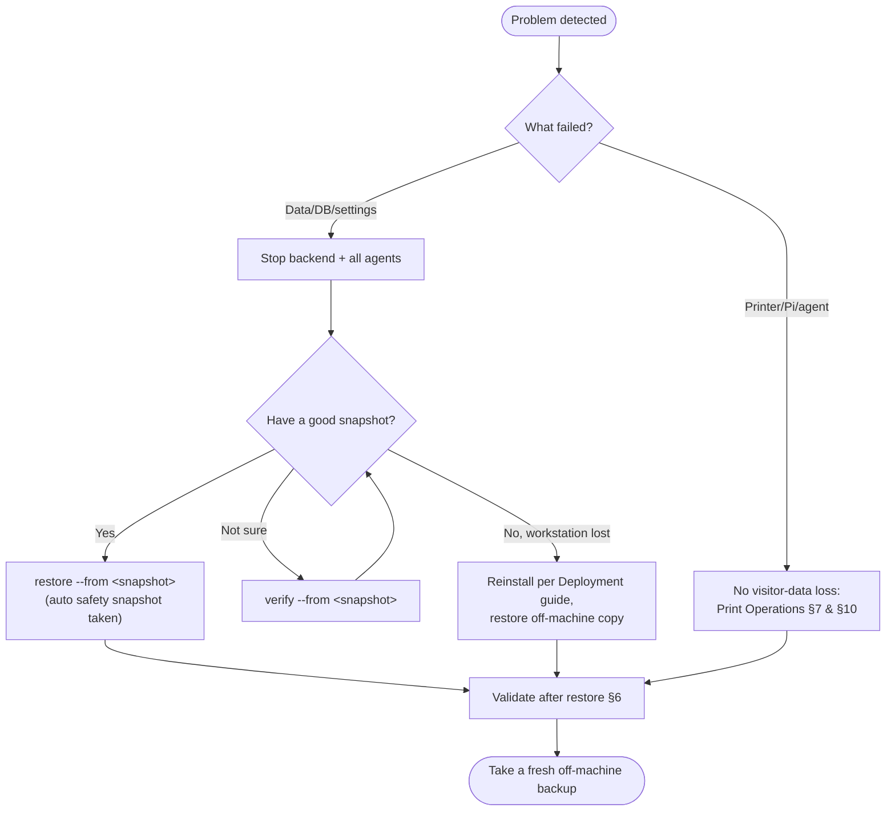

# Backup & Recovery — PBC Guest Kiosk

**Audience:** Camp administrators and volunteer IT responsible for not losing visitor
data.

**Purpose:** How to take backups and how to recover from data loss using the tools
that actually ship with this system. Everything here is grounded in the backup tool
(`backend/app/backup.py`, run through `scripts/backup.py` and `scripts/restore.py`).
The authoritative, scenario-driven runbook is
[Disaster Recovery](../DISASTER-RECOVERY.md); this guide is the operational companion.

**Related:** [Administration](Administration.md) · [Troubleshooting](Troubleshooting.md) ·
[Print Operations](PrintOperations.md) · [Quick Reference](QuickReference.md)

---

## 1. Backup Overview

A **backup** is a single, verified snapshot of everything needed to resume operations
**as of the moment the snapshot is taken**: the database, uploaded photos and badges,
QR/theme assets, and runtime configuration. A restore returns the system to that captured
state — any check-ins, photos, or prints made *after* the snapshot are not in it and are
lost on restore, so your recovery-point exposure depends on how recently you backed up
(see [§5](#5-restore-process)). The database is copied with SQLite's online backup
API, so a snapshot taken while the backend is running is transactionally consistent,
and every snapshot is integrity-checked as it is written.

**Backups are manual.** There is **no** scheduler, cron job, or automatic backup built
into this system — a person (or an external OS scheduler you add) must run the backup
command. Do not assume backups are happening on their own.

What is and is not captured (full table in
[Disaster Recovery §1](../DISASTER-RECOVERY.md#1-what-is-protected)):

- **Captured:** `backend/visitor_kiosk.db`, `backend/uploads/` (photos, badges,
  qr-codes, theme-logos), `backend/config/` (`system_settings.json`,
  `user_themes.json`).
- **Not captured (back up by hand, securely):** the repository-root `.env` and
  `print-agent/.env` — they hold secrets and are deliberately excluded. See
  [Security Controls §8](../06-Reference/SecurityControls.md#8-backup-protections) and
  [§10](../06-Reference/SecurityControls.md#10-secrets-handling).

Data-lifecycle context: [Data Flow §7](../01-Architecture/DataFlow.md#7-backups).

## 2. Backup Types

There is one snapshot format, used in three operational ways:

| Type | How it's made | Purpose |
| --- | --- | --- |
| **Routine snapshot** | `python scripts/backup.py backup` | Daily on-machine protection |
| **Off-machine copy** | same, with `--dest <removable/network path>` | Survives loss of the whole workstation |
| **Pre-restore safety snapshot** | created **automatically** by a restore | Makes a restore itself reversible |

The pre-restore safety snapshot is not something you run — the restore tool takes it
for you before overwriting live data (see [§5](#5-restore-process)).

## 3. Backup Locations

- **Default:** `backend/backups/<UTC-timestamp>/` — e.g.
  `backend/backups/20260801-153000Z/`. This directory is git-ignored (backups are data,
  not source).
- **Off-machine:** pass `--dest` to write to removable or network storage, e.g.
  `--dest E:\pbc-kiosk-backups`. Always keep at least one recent copy **off the
  workstation**.
- **Retention:** the most recent **14** snapshots in a destination are kept by default;
  older ones are pruned automatically. Override with `--retention <n>`.

Each snapshot directory contains a `manifest.json` (recording every file's size and
SHA-256), the database copy, an `uploads/` tree, and a `config/` folder.

## 4. Manual Backup Process

Run from the repository root with the backend Python environment available.

```powershell
# Take a routine snapshot (kept in backend/backups, newest 14 retained)
python scripts/backup.py backup

# Off-machine copy with longer retention (recommended before shutdown / weekly)
python scripts/backup.py backup --dest E:\pbc-kiosk-backups --retention 30

# Optional label to make a snapshot easy to find later
python scripts/backup.py backup --label pre-upgrade

# See what snapshots exist
python scripts/backup.py list

# Confirm a snapshot is complete and uncorrupted
python scripts/backup.py verify --from backend\backups\20260801-153000Z
```

**Recommended cadence** (from the runbook): daily during camp, one off-machine copy
weekly, and one immediately before the week-7 shutdown.

> A backup can be taken while the backend is running — it does not require downtime.
> Restores do (see below).

## 5. Restore Process

> **Stop the backend and all print agents first.** Restoring under a running backend
> can corrupt the swapped-in database.

1. Stop the backend service and every Raspberry Pi print agent.
2. Restore the chosen snapshot:

   ```powershell
   python scripts/restore.py restore --from backend\backups\20260801-153000Z
   ```

   What the tool does for you:
   - **Verifies the snapshot** before touching anything.
   - **Takes a pre-restore safety snapshot** of current live data (labelled
     `pre-restore`) so the restore is reversible. Use `--no-safety` **only** when the
     target is truly empty (a clean rebuild).
   - **Restores the database atomically** — it rebuilds into a temporary file,
     integrity-checks it, and only then swaps it in. A failed check leaves the existing
     live database untouched.
   - **Reproduces the snapshot exactly** — upload categories or config files that the
     snapshot recorded as absent are *removed* from the live install, so you get the
     snapshot's state, not a merge.
   - Prompts for confirmation unless you pass `--yes`.
3. Start the backend and confirm the visitor list loads.
4. Power the print agents back on — they re-register automatically (their credentials
   are in the restored database) and resume polling.

Authoritative detail and options: [Disaster Recovery §3](../DISASTER-RECOVERY.md#3-restore-a-backup).

## 6. Validation After Restore

Immediately after a restore, confirm the system is genuinely healthy:

- `curl http://<backend-host>:8000/health` reports healthy (not 503).
- The admin sign-in works and the visitor list shows expected records (spot-check a
  recent check-in).
- A test check-in produces a badge that prints from at least one station.
- Each Raspberry Pi shows recently-seen/online on Administration → Print Agents.
- Take a **fresh backup** and copy it off-machine.

See also the runbook's [post-recovery checklist](../DISASTER-RECOVERY.md#5-post-recovery-checklist).

## 7. Disaster Scenarios

| Failure | Recovery |
| --- | --- |
| **Corrupted database** | Stop services; restore the most recent snapshot that passes `verify` ([§5](#5-restore-process)). |
| **Workstation lost/dead** | Reinstall per the [Deployment guide](../02-Deployment/README.md); restore the latest **off-machine** snapshot; start the backend. |
| **Fresh / clean rebuild** | Restore into the new install; `--no-safety` is fine when the target is empty. |
| **Dead Raspberry Pi / print agent** | This is *not* a data-loss event — jobs recover automatically. Follow [Print Operations §10](PrintOperations.md#10-print-agent-replacement-procedure). |
| **Accidental bad change to settings/data** | Restore the most recent good snapshot; the automatic pre-restore safety snapshot protects the current state. |
| **Lost `.env` secrets** | Restore them from your separate, secure copy — they are **not** in backups ([§1](#1-backup-overview)). |

Print-side failures (a printer or agent, not data) are handled in
[Print Operations §7](PrintOperations.md#7-failover-behavior) and
[Disaster Recovery §4](../DISASTER-RECOVERY.md#4-print-agent--print-job-recovery-automatic).

## 8. Recovery Decision Tree



## 9. Recovery Validation Checklist

- [ ] Backend started cleanly and `/health` is healthy (not 503).
- [ ] Admin login works.
- [ ] Visitor list shows expected records; a recent check-in is present.
- [ ] A test badge prints from at least one station.
- [ ] Every Raspberry Pi shows recently-seen/online.
- [ ] `.env` secrets are in place (restored from your secure copy if the host was
      rebuilt).
- [ ] A fresh backup has been taken and copied off-machine.

## 10. Recovery Testing Recommendations

Backups you have never restored are unproven. Periodically:

- **Verify snapshots** with `python scripts/backup.py verify --from <snapshot>` so
  silent corruption is caught early.
- **Practice a restore** into a scratch/clean location (or a spare machine) using
  `--no-safety`, and confirm the backend starts and data loads — this rehearses the
  real procedure without risk to production.
- **Test before you need it:** run one full backup-and-restore rehearsal before the
  camp season and again before the week-7 shutdown.
- **Keep the off-machine copy current** — a backup on the same failed workstation is no
  backup at all.

These rehearsals also validate that whoever is on call can actually perform a recovery
without tribal knowledge, which is the point of this guide.
