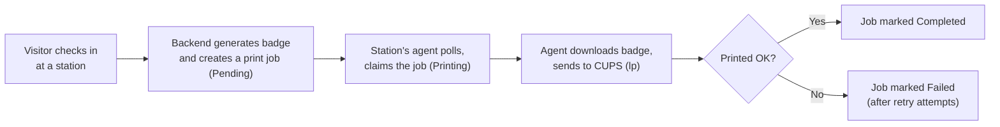

# Print Operations — PBC Guest Kiosk

**Audience:** Camp administrators and volunteer IT who keep badge printing working.

**Purpose:** How to operate, monitor, and recover the badge-printing system — the
stations, the Raspberry Pi print agents, and the print queue. This guide is
operational; the deep mechanics live in
[Print Architecture](../01-Architecture/PrintArchitecture.md) and are linked, not
repeated. Printer/OS setup lives in the [Print Server guide](../PRINT-SERVER.md).

**Related:** [Administration](Administration.md) · [Troubleshooting](Troubleshooting.md) ·
[Backup & Recovery](BackupAndRecovery.md) · [Quick Reference](QuickReference.md)

---

## 1. Print Architecture Overview

Three distinct concepts drive every print. Keeping them straight prevents most
operational mistakes:

| Concept | What it is | Where you manage it |
| --- | --- | --- |
| **Printer** | The physical Brother QL-800 and its CUPS queue on a Pi | On the Pi ([Print Server guide](../PRINT-SERVER.md)) |
| **Print Agent** | The program on the Pi that pulls jobs and prints them | Administration → Print Agents |
| **Print Station** | The named check-in location a badge is routed to | Administration → Print Stations |

The full rationale is [Print Architecture §1](../01-Architecture/PrintArchitecture.md#1-why-three-concepts-printer-vs-print-agent-vs-print-station);
short definitions are in the [System Glossary](../00-Executive/SystemGlossary.md#the-three-most-confused-terms).

## 2. Printer Workflow

End to end, one badge:

The job's status is always one of exactly four values — **Pending, Printing,
Completed, Failed** ([Print Architecture §3](../01-Architecture/PrintArchitecture.md#3-the-print-queue-and-its-statuses)).
Operators watch this on the staff **Print Queue** screen.

## 3. Print Stations

A **print station** is where a badge is meant to come out (for example "Main Gate").
It is the **routing destination** for a check-in.

- Each station has a display name and a URL-safe **slug**, plus a downloadable **QR
  code** encoding `<base check-in URL>/<slug>`.
- Visitors reach a station by scanning that station's QR/link; the resulting check-in
  is **bound to that station** and its badge prints there. This binding is
  fail-closed — a check-in with no valid station is refused rather than printed
  somewhere arbitrary.
- Disable a station to take it out of service; it then shows as in maintenance and
  accepts no new check-ins.

Create, enable/disable, rename, and download QR codes on **Administration → Print
Stations** ([Administration §9](Administration.md#9-print-station-management)).
Concept: [Print Architecture §4](../01-Architecture/PrintArchitecture.md#4-print-stations).

## 4. Print Agents

A **print agent** is the small program (`print-agent/print_agent.py`) running on a
Raspberry Pi. It is **CUPS/Linux only** — there is no Windows agent.

What it does on a short loop (about every 2 seconds by default):

1. **Heartbeat** — reports itself to the backend so staff can see it online.
2. **Poll** for pending jobs at its station.
3. For each job: **claim → download the badge → print via CUPS (`lp`) → mark
   Completed or Failed.**

Key configuration (in `print-agent/.env`): `PBC_API_BASE`, `PBC_PRINTER_NAME`
(default `QL800_BROTHER`), `PBC_PRINT_AGENT_POLL_SECONDS` (default `2`),
`PBC_PRINT_STATION_SLUG`, and the credential values `PBC_PRINT_AGENT_TOKEN` /
`PBC_PRINT_AGENT_KEY`. See [Environment Variables](../06-Reference/EnvironmentVariables.md).

A **newly registered agent enrolls disabled** and cannot print until an administrator
approves it — a deliberate safeguard
([Security Controls §7](../06-Reference/SecurityControls.md#7-print-agent-authentication)).
Behavior detail: [Print Architecture §5](../01-Architecture/PrintArchitecture.md#5-print-agents-and-the-poll-loop).

## 5. Queue Ownership

Every print job belongs to **one station**, and that station is the source of truth
for where the badge prints. Agents are attributed to a station, and they only work
that station's jobs. This is why:

- Moving a badge to a different printer means **redirecting the job to another
  station** ([§8](#8-redirect-printing)) — not reconfiguring a printer.
- A job is never "owned" by a printer or an agent directly; it is owned by a station,
  and whichever healthy agent at that station claims it prints it.

Data model view: [Data Flow §5](../01-Architecture/DataFlow.md#5-print-jobs).

## 6. Claim Leases

To keep printing **duplicate-resistant**, an agent must **claim** a job before printing.
A claim is a time-boxed **lease** (about two minutes): the backend hands the job to
exactly one agent, and a second agent asking for the same job is refused. Each claim
carries a generation marker so a late reply from a previous lease can never overwrite
a newer claim.

Operationally you rarely touch this — it is what stops two agents from **concurrently**
claiming and printing the same job. It does **not** prevent every duplicate: if an agent
prints a badge and then crashes before reporting done, recovery can requeue the job and a
second badge can print (see [§7](#7-failover-behavior)). The mechanism is
[Print Architecture §7](../01-Architecture/PrintArchitecture.md#7-claim-leases-and-duplicate-resistant-printing).

## 7. Failover Behavior

If an agent dies mid-print (Pi crash, unplugged, power loss), the backend recovers the
job **automatically** — no database editing:

- A job stuck in `Printing` past its lease, **whose owning agent has also stopped
  checking in**, is requeued to `Pending` for a healthy agent. A slow-but-alive agent
  is left alone so a legitimately long print is not interrupted.
- Recovery is **request-driven**: it happens when the queue is polled or a job is
  claimed.
- After a small number of failed attempts a job is marked **Failed** with a reason,
  rather than retrying forever.

Practical outcomes:

| Situation | What happens |
| --- | --- |
| **Station with more than one agent** | Self-heals — the surviving agent requeues and prints the dead agent's job. |
| **Single-agent station, the agent dies** | The job waits in place. Recover by bringing the Pi back, **redirecting** the job to another station, or **reprinting** from the visitor record. |

> **Possible duplicate badge.** Recovery requeues a job when its agent went away without
> reporting `Completed`. If that agent had already printed the badge before it died, the
> requeued job prints a **second** physical badge. This is expected failover behavior, not
> a malfunction — the system favors "print again" over "silently skip." There is **no**
> automatic duplicate detection, so when a station recovers or a redirect/reprint
> completes, the operator at the printer should **check for and discard any duplicate
> badge**.

This mirrors the authoritative runbook —
[Disaster Recovery §4](../DISASTER-RECOVERY.md#4-print-agent--print-job-recovery-automatic)
and [Print Architecture §10](../01-Architecture/PrintArchitecture.md#10-retries-and-recovery).

## 8. Redirect Printing

**Redirect** moves a **still-pending** job from one station to another — used when a
station's printer is down but guests are already checked in there.

- Available to any signed-in staff member, from the **Print Queue**.
- Only **Pending** jobs can be redirected; the job is re-homed to another **enabled**
  station and stays `Pending` so that station's agent prints it.
- Redirecting is recorded in the audit log.

> Redirect vs. Reprint: **Redirect** re-routes an existing pending job. **Reprint**
> creates a brand-new job from a visitor's record ([Administration §7](Administration.md#7-badge-reprints)).
> Detail: [Print Architecture §9](../01-Architecture/PrintArchitecture.md#9-redirect-workflow).

## 9. Printer Replacement Procedure

Replacing a **physical printer** (the Brother QL-800) at an existing station:

1. Power down the old printer; connect the replacement to the same Pi by USB.
2. On the Pi, recreate the CUPS queue **using the same queue name** the agent expects
   (`QL800_BROTHER`), following the [Print Server guide](../PRINT-SERVER.md#create-printer-queue).
   Keeping the name means `PBC_PRINTER_NAME` does not change.
3. Re-apply the known-good settings: `PageSize=62x100`, `BrPriority=BrQuality`,
   `BrBrightness=15` ([Print Server guide](../PRINT-SERVER.md#brother-driver-recommended-settings)).
4. Verify with `lpstat -p` (idle) and a CUPS test page.
5. Print one real badge from a test check-in and confirm sizing/brightness/cut.

No backend or station change is needed — the station and its agent are unchanged; only
the hardware and its CUPS queue were replaced. Reference: [Print Server rebuild
checklist](../PRINT-SERVER.md#rebuild-checklist).

## 10. Print Agent Replacement Procedure

Replacing a **Raspberry Pi / print agent** (dead Pi, or adding a spare):

1. Build the Pi and printer per the [Print Server guide](../PRINT-SERVER.md) until a
   CUPS test page prints.
2. Install the print agent and set `print-agent/.env`: `PBC_API_BASE` (the backend),
   `PBC_PRINTER_NAME` (the CUPS queue), and `PBC_PRINT_STATION_SLUG` (the station this
   Pi serves).
3. Start it: `python print_agent.py`. On first contact it **self-enrolls disabled**.
4. In the app, go to **Administration → Print Agents** and **approve/enable** the new
   agent ([Administration §10](Administration.md#10-print-agent-monitoring)).
5. **Disable the old/dead agent** so it no longer counts as a station member.
6. Print a test badge and confirm the job completes and the agent shows online.

Because print-job recovery is automatic, a replacement agent at a multi-agent station
will pick up any waiting jobs on its next poll ([§7](#7-failover-behavior)). Deeper
recovery guidance: [Disaster Recovery §4](../DISASTER-RECOVERY.md#4-print-agent--print-job-recovery-automatic).

> This procedure is Raspberry Pi / CUPS only, matching the shipped agent. There is no
> Windows print agent to install.

## 11. Common Print Failures

| Symptom | Likely cause | Action |
| --- | --- | --- |
| Job stays **Pending** | No online agent at the station | Check the agent ([§4](#4-print-agents)); redirect or reprint ([§8](#8-redirect-printing)) |
| Job stuck **Printing** then requeues | Agent died mid-job; lease recovery | Let a healthy agent take it; recover a single-agent station manually ([§7](#7-failover-behavior)) |
| Job **Failed** | Exhausted print attempts | Fix the printer/agent, then reprint |
| Guest receives **two** badges | Recovery reprinted after an agent crashed post-print | Expected during failover; discard the extra badge ([§7](#7-failover-behavior)) |
| Prints blank/garbled or printer red light | Wrong `PageSize` / driver | Apply known-good settings ([Print Server guide](../PRINT-SERVER.md#important-notes)) |
| Claims but never prints | `PBC_PRINTER_NAME` ≠ CUPS queue name | Align the name ([Troubleshooting §8](Troubleshooting.md#8-print-agent-problems)) |
| Photos look dithered/grainy | ptouch-ql driver limitation | Switch to the Brother driver ([Print Server guide](../PRINT-SERVER.md#option-2-brother-driver-best-badge-quality)) |
| New Pi never prints | Agent still disabled | Approve it ([Administration §10](Administration.md#10-print-agent-monitoring)) |

Failure-scenario theory: [Print Architecture §11](../01-Architecture/PrintArchitecture.md#11-offline-printer-and-failure-scenarios).

## 12. Validation Checklist

Use after any print change (new printer, new agent, driver change, station edit):

- [ ] `lpstat -p` shows the queue **idle** on the Pi.
- [ ] The station's agent shows **online** on Administration → Print Agents.
- [ ] A test check-in at that station creates a job that reaches **Completed**.
- [ ] The printed badge has correct **size (62×100), brightness, alignment, and cut**.
- [ ] A redirect of a pending job to another station prints there
      ([§8](#8-redirect-printing)).
- [ ] The station QR code opens the correct station's check-in page
      ([§3](#3-print-stations)).
- [ ] The full path — iPad/tablet check-in → photo → badge → print — succeeds end to
      end.
