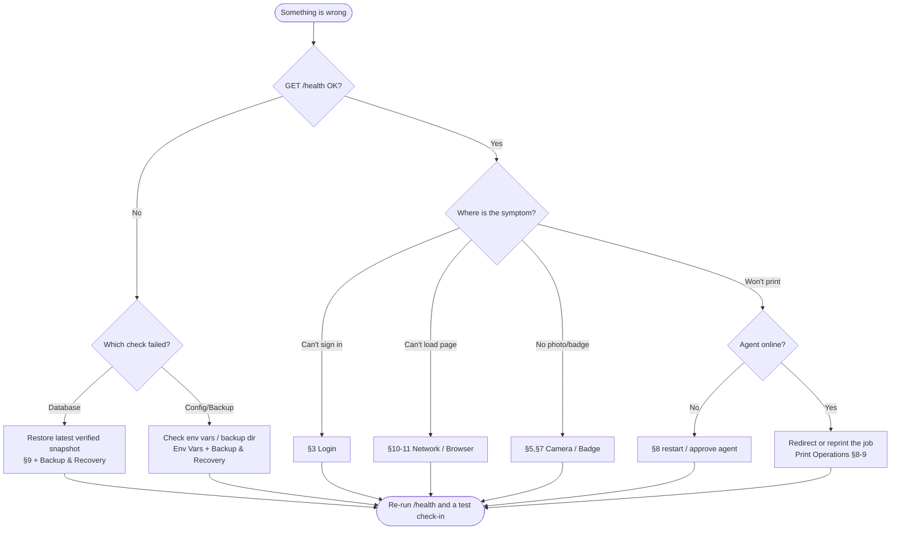

# Troubleshooting — PBC Guest Kiosk

**Audience:** Anyone keeping the kiosk running — office staff, camp administrators,
volunteer IT.

**Purpose:** Diagnose and fix the problems that actually occur, using only the
checks the system really supports. Every command and file path below exists in this
repository. If a fix here does not resolve the issue, escalate rather than improvise.

**Related:** [Administration](Administration.md) · [Print Operations](PrintOperations.md) ·
[Backup & Recovery](BackupAndRecovery.md) · [Quick Reference](QuickReference.md) ·
[Print Server guide](../PRINT-SERVER.md)

---

## 1. Troubleshooting Philosophy

Work from the outside in, and change one thing at a time:

1. **Identify the component.** Kiosk (browser) → backend API → database, and
   separately backend → print agent → printer. Most problems are isolated to one of
   these. The rule that makes this tractable: *everything connects **to** the
   backend* — see [Network Flow §1](../01-Architecture/NetworkFlow.md#1-the-one-rule-everything-connects-to-the-backend).
2. **Confirm health first** ([§2](#2-system-health-checks)) before touching anything.
3. **Prefer reversible actions.** Redirect or reprint before restarting; back up
   before restoring; disable before deleting.
4. **Never hand-edit the live database.** Use the backup/restore tooling
   ([§9](#9-database-problems)).
5. **Read the logs** ([§13](#13-logs-collection-guide)) instead of guessing.

## 2. System Health Checks

Three endpoints, in increasing depth:

| Check | Command | Healthy result |
| --- | --- | --- |
| Reachable | `curl http://<backend-host>:8000/` | `{"application": "PBC Visitor Kiosk", "version": "1.0"}` |
| Alive (cheap) | `curl http://<backend-host>:8000/health/live` | `{"status": "alive"}` |
| Ready (deep) | `curl http://<backend-host>:8000/health` | status healthy; database, directories, configuration, backup all OK |

- `/health/live` does no database or disk work — use it to confirm the process is up.
- `/health` verifies the database (a `SELECT 1`), required directories, configuration,
  and the backup subsystem, and returns **HTTP 503** if any critical check fails. The
  print infrastructure is reported but is *informational* and never makes `/health`
  fail. Full semantics: [Security Controls §11](../06-Reference/SecurityControls.md#11-health-monitoring-protections)
  and [System Components §8](../01-Architecture/SystemComponents.md#8-monitoring--health).

If `/health` returns 503, read which check failed and jump to the matching section:
database → [§9](#9-database-problems), configuration → [Environment Variables](../06-Reference/EnvironmentVariables.md),
backup → [Backup & Recovery](BackupAndRecovery.md).

## 3. Login Problems

| Symptom | Cause | Fix |
| --- | --- | --- |
| "Locked" / can't sign in after several tries | Account lockout after repeated failures | Wait out the lockout window, or have an admin reset the password. See [Security Controls §3](../06-Reference/SecurityControls.md#3-account-lockout-f-009). |
| Correct password rejected | Account disabled | An admin re-enables it on Administration → Users. |
| Forced to change password | `must change password` flag (new/reset account) | Set a new password; this is expected once. |
| Nobody can sign in, kiosk otherwise loads | Frontend pointed at the wrong/downed backend | Verify `VITE_API_BASE` and that `/health` answers. See [Environment Variables](../06-Reference/EnvironmentVariables.md). |
| No admin account exists at all | First-run seeding didn't happen | Confirm `PBC_DEFAULT_ADMIN_*` are set, then restart the backend so the initial admin is seeded (only created when no users exist). |

## 4. Visitor Search Problems

Search and history match on **first and last name**. If a returning visitor or their
history is not found:

- Confirm the name is spelled exactly as originally entered (grouping is name-based).
- Remember two different people with the same name are grouped together — this is
  documented behavior, not a fault ([Administration §5](Administration.md#5-visitor-history-review)).

There is no free-text or fuzzy search to configure; do not look for a setting that
does not exist.

## 5. Camera Problems

Photo capture uses the device's camera through the browser, so problems are almost
always at the device/browser layer:

- **Permission denied / no prompt:** grant camera permission for the kiosk site in the
  browser, then reload.
- **Camera works elsewhere but not in the kiosk:** browsers only allow camera access in
  a **secure context** (HTTPS, or `localhost`). If the kiosk is served over plain HTTP
  from another machine, the browser will block the camera — serve it over HTTPS or from
  localhost.
- **Wrong camera (e.g., rear vs. front on a tablet):** pick the correct camera in the
  browser/device settings.
- **Frozen preview:** close other apps using the camera, then reload the page.

There is no server-side camera setting to change; the backend only receives the
finished photo upload.

## 6. Printing Problems

Start at the queue, then the agent, then the printer.

1. **Look at the Print Queue** (staff hub → Print Queue). Note the job's status —
   `Pending`, `Printing`, `Completed`, or `Failed`. These four are the only statuses
   that exist ([Print Architecture §3](../01-Architecture/PrintArchitecture.md#3-the-print-queue-and-its-statuses)).
2. **Job stuck in `Pending`:** no healthy agent is claiming it. Check the station's
   agent is online ([§8](#8-print-agent-problems)); if the station's only Pi is down,
   **redirect** the job to another station or **reprint** from the visitor record
   ([Print Operations §8–9](PrintOperations.md#8-redirect-printing)).
3. **Job stuck in `Printing` then requeued:** normal lease recovery when an agent dies
   mid-job — a healthy agent will pick it up ([Print Operations §7](PrintOperations.md#7-failover-behavior)).
4. **Job `Failed`:** it exhausted its attempts. Investigate the printer/agent, then
   reprint. 
5. **Printer in a red/error state or wrong label size:** this is a CUPS/printer issue on
   the Pi — see [Printing Problems in Print Operations §11](PrintOperations.md#11-common-print-failures)
   and the known-good settings (`PageSize=62x100`, `BrPriority=BrQuality`,
   `BrBrightness=15`) in the [Print Server guide](../PRINT-SERVER.md).

Useful printer commands **on the Pi**:

```bash
lpstat -p            # is the queue enabled/idle?
lpstat -o            # what jobs are queued in CUPS?
lpstat -t            # full CUPS status
lpoptions -p QL800_BROTHER   # current printer options
cancel -a            # clear the CUPS queue
```

## 7. Badge Generation Problems

A badge cannot be generated until a **photo** has been captured for that visitor.

| Symptom | Cause | Fix |
| --- | --- | --- |
| "Badge not ready" / no badge to print | No photo captured yet | Capture the photo first ([Camera Problems](#5-camera-problems)). |
| Photo upload rejected | Over the size limit or unreadable image | Retake the photo; uploads are capped and must decode as an image. See [Security Controls §5](../06-Reference/SecurityControls.md#5-upload-boundaries-f-010). |
| Badge colors/styling look wrong | Badge appearance is fixed in code -- there is no badge theme control in v1 | Change-managed code edit, not a setting ([Administration §8](Administration.md#8-theme-selection)). For *printed* color/quality, check the [Brother driver settings](../PRINT-SERVER.md#brother-driver-recommended-settings). |
| Badge size/placement wrong | Layout is fixed in code | This is a change-managed code edit, not a setting ([Quick Reference](QuickReference.md#badge-appearance)). |

## 8. Print Agent Problems

The print agent runs on the Raspberry Pi and is **CUPS/Linux only**.

| Symptom | Cause | Fix |
| --- | --- | --- |
| New Pi never prints | Agent enrolls **disabled** by design | Approve/enable it on Administration → Print Agents ([Security Controls §7](../06-Reference/SecurityControls.md#7-print-agent-authentication)). |
| Agent shows offline/stale | Process not running, or can't reach backend | On the Pi, confirm `python print_agent.py` is running; test `curl http://<backend-host>:8000/` from the Pi. |
| Agent claims jobs but nothing prints | `PBC_PRINTER_NAME` doesn't match the CUPS queue | Set it to the real queue (`QL800_BROTHER` or `QL800`) — see [Print Server guide](../PRINT-SERVER.md#print-agent-location). |
| Agent rejected by backend | Wrong/absent token or key | Verify `PBC_PRINT_AGENT_TOKEN` / `PBC_PRINT_AGENT_KEY`; re-enroll if needed ([Print Operations §10](PrintOperations.md#10-print-agent-replacement-procedure)). |

Agent behavior and the poll loop are described in
[Print Operations §4](PrintOperations.md#4-print-agents).

## 9. Database Problems

The database is a single SQLite file at `backend/visitor_kiosk.db`.

- **Never open or edit the live database by hand**, and never edit it while the backend
  is running.
- If `/health` reports the database check failing, or data looks corrupted, **restore
  the most recent snapshot that passes `verify`** — do not attempt manual repair. Stop
  the backend and all agents first. Full procedure:
  [Backup & Recovery §5](BackupAndRecovery.md#5-restore-process).
- To confirm a snapshot is good before relying on it:
  `python scripts/backup.py verify --from <snapshot-dir>`.

## 10. Network Problems

All devices talk **to** the backend; the backend never calls out to them
([Network Flow](../01-Architecture/NetworkFlow.md#1-the-one-rule-everything-connects-to-the-backend)).
So "can't reach the kiosk/backend" is almost always addressing or firewall.

- **Backend not reachable from other devices:** confirm it is listening on all
  interfaces, not just localhost. On a Windows host:
  `netstat -ano | findstr 8000` should show it listening on `0.0.0.0:8000`.
- **Reachable locally but not from the Pi/tablets:** a VLAN or firewall is blocking TCP
  8000 between segments — allow it.
- **Intermittent:** confirm stable addressing (a fixed IP or reliable hostname) for the
  backend so `VITE_API_BASE` and `PBC_API_BASE` stay valid.

## 11. Browser Problems

- **Stale UI after an update:** hard-refresh (Ctrl+F5) or clear the site cache.
- **Blocked camera or "mixed content":** serving the kiosk over HTTP while the backend
  is HTTPS (or vice-versa) can trip browser security. Keep the kiosk on a secure origin
  ([Camera Problems](#5-camera-problems)).
- **Very old browser:** use a current mainstream browser; the kiosk is a modern web app.

## 12. Recovery Decision Tree



## 13. Logs Collection Guide

Two rotating log files live under `backend/logs/`:

| File | Contents | Rotation |
| --- | --- | --- |
| `backend/logs/guest-kiosk.log` | Application log (requests, errors, agent activity) | 10 MB × 5 (`.1`…`.5`) |
| `backend/logs/audit.log` | Security-relevant actions (logins, user/station/agent changes, reprints, redirects) | 5 MB × 10 (`.1`…`.10`) |

To gather logs for escalation:

1. Copy the entire `backend/logs/` directory (including the numbered `.1`…`.N` files).
2. Note the **date/time** the problem occurred and the **visitor or job** involved.
3. For print issues, also capture the Print Queue state — the staff Print Queue screen
   (or `GET /api/print-jobs`) shows each job's status, station, attempts, and error.
4. For printer issues, capture `lpstat -t` from the Pi.

Audit logging is described in
[Security Controls §6](../06-Reference/SecurityControls.md#6-audit-logging); do not
paste secrets from `.env` files into any report.

## 14. Escalation Guidance

Escalate to camp IT (and take a backup first) when:

- `/health` still fails after checking configuration and the database.
- Data loss or corruption is suspected and a restore is required.
- Hardware is implicated — a dead Raspberry Pi, a failed printer, or a network segment
  that won't pass TCP 8000.
- A change to printer settings, badge layout, or authentication is needed (change
  management — [Administration §13](Administration.md#13-common-administrative-tasks)).

Provide: what changed recently, the exact symptom and time, the `/health` result, and
the collected logs from [§13](#13-logs-collection-guide).
